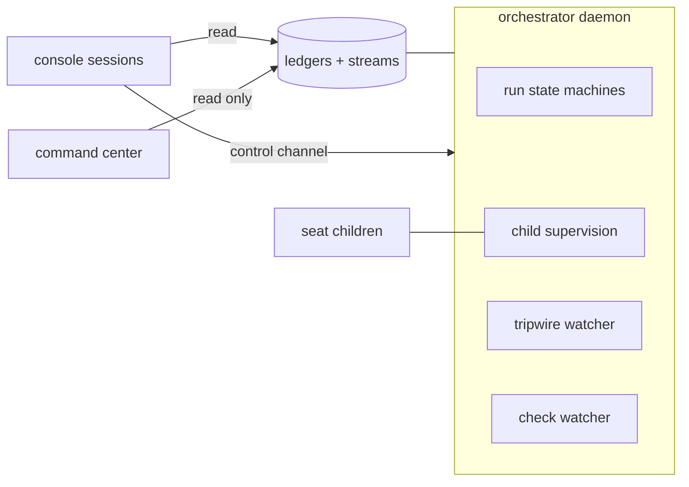

# Architecture

This document is the component map. Detail lands in ADRs as components get
built. [doctrine.md](doctrine.md) states the rules behind the design.

## Shape of the system

One durable **orchestrator daemon** owns every open run as an in-process state
machine. The OS service manager keeps it alive (at-boot, restart-on-failure).
Seats run as headless child processes; a child exit is the transition event.
All run state lives in ledgers; a restart resumes every open run at its
recorded stamp. "Nobody invoked the next phase" is impossible by construction.

The daemon has two start forms (ADR-0050). `olympusd run` is the foreground
form, which a service manager wires because a service manager supervises the
process it starts. `olympusd start` is the form a person types: it spawns the
same daemon detached, in a session of its own, with its two streams appended to
files under the home, waits for the home's lock file to name the pid, and
returns. The console that gave the command cannot end it. That spawn is the one
detaching call site in the harness; a seat takes the opposite shape because a
seat is waited on and ended as a tree (ADR-0016), and a test reads every
child-process call site to keep it the only one.

Around the daemon:

- **Console sessions** — any Claude session is a cockpit: it reads the ledgers
  and writes control-channel commands the daemon obeys (pause, hold, kill,
  launch, answer). No session owns a run.
- **Command center** — a standalone read-only page plus a small GET server
  rooted at the daemon home. The daemon does not know it exists.
- **Tripwire watcher** — a supervised in-daemon process that re-evaluates
  tripwires when matching events append, and reads stage duration against the
  duration history when a stage heartbeat appends. It classifies and executes
  nothing, and it holds no run.
- **Workflow watcher** — an in-daemon poll of the workflow runs no request
  path covers: the workflows a project names in `watchedWorkflows`, on its
  default branch. It reads the forge's terminal conclusion on the most recent
  completed run, never an elapsed. A red opens one loud item per red run; the
  next green records the recovery that answers it, and the red names the jobs
  of the run that were not green. It holds no run (ADR-0035).
- **Eval seat** — an instance-scoped judgment seat fired every five ships of
  any lane. The window is every ship merged after the newest ship the last
  review named; the ship list carries each run's lane and, for a repair, the
  escape it was launched against. Its report lands under `eval/` in the
  daemon home; the queued `eval-review` event points to it, with the window's
  run ids and its count per lane. Proposals only; nothing self-executes
  (ADR-0012).
- **Notifier** — one optional push target (webhook or command argv) the
  instance config names. It sends parks, run closes and every loud record out
  of the daemon and does nothing else. Unconfigured, it is not there.

## The continuous run

A story runs as one continuous run with these internal states:

readiness → spec birth → spec gate → suite authoring → adversary → freeze →
implementation → verdict (repair rounds as needed) → ship → close-out.

Two lanes share the machinery:

- **Story lane** — the full chain above.
- **Repair lane** — for defects and chores: no spec birth (the intake ticket
  is the spec), no adversary. Fix + regression test + full deterministic gates
  + one generalist review round + one verdict + ship. Writes the run ledger
  and the escapes-ledger entry at close. A ticket whose `touched-paths` block
  names ground the lane's diff policy denies is refused at launch (ADR-0067).

A story launch may **resume from a prior run's freeze**: it starts on the
frozen commit, carries the born spec and the freeze record over, stamps
`freeze-inherited` rather than a freeze it never earned, and enters at the
first post-freeze stage. A run that did not ship keeps its branch so the
frozen tree stays reachable. An advanced default branch is merged in and the
red-state gate re-runs; a suite the advance touched, a merge conflict, or a
suite that goes green refuses the launch by name.

## Stores

Three stores plus two indexes, all append-only, all under the daemon home:

- **Per-run ledger** — every run event; archived with the run.
- **Instance ledger** — run-independent events: daemon lifecycle, launches,
  arming changes, config changes, starvation, tripwire breaches, and the
  acknowledgment pairs the standing set of known harness defects is folded
  from.
- **Escapes ledger** — central record of post-merge defects and chores; the
  counted source for quality metrics.
- **Stream indexes** — two central files (queued, loud). The daemon appends a
  pointer (ledger + seq) plus a one-line gist when it stamps a stream-classed
  event, and it appends the pointer before the event itself, so nothing is
  readable in a ledger before it is findable on its stream (ADR-0002). The
  full event lives only in its source ledger.

Every line carries the envelope: `seq` (monotonic per ledger), `ts` (recording
and duration history only; never a trigger), `event` (closed registry),
`actor`, `stream` (stream-classed events only), `refs`, payload inline. The
event registry is closed; a new type enters only by a design-level decision.

A run's length derives from its own ledger in two numbers, and the close-out
record stamps both: wall, from the launch stamp to the close, and active, the
same stretch minus every span the run spent parked on a human or inert under
an unresolved liveness violation. Overlapping spans count once, a span still
open at the end runs to it, and nothing is held between calls, so a restart
and an archive re-derive the same pair. Every duration read that keys on run
length — the command-center ship stat and its target, the eval seat's window
— keys on the active one, with the wall beside it (ADR-0036).

Every loud event and every breach gets a paired `resolved` append in its
source ledger. The open set is derivable: index entries without a linked
resolution. Each loud class names the event that owns it in one table, and the
engine pairs the resolution when that event lands; the run close is the
backstop for the classes no event owns.

## Configuration

Two levels; the ownership test decides placement.

- **Instance config** — daemon home, machine-scoped: model semaphores, paths,
  ledger home, notification-stream wiring, the push `notifier` target, slot
  caps keyed by project, the name patterns this host holds credentials in
  (`secretEnv`), the exact names a judgment seat's replay probe may carry
  (`probeCredentials`), where this host keeps the values of the credentials
  the projects declare (`credentialStore`), and how long a seat child of this
  host may emit nothing before it is taken to be dead (`seatSilenceMs`). The
  console edits it live; no PR.
- **Project config** — one JSON versioned in the project repo: repo facts,
  commands, gates, conventions, the judgment panel (`review.lenses`), lane
  specifics, per-lane budget thresholds,
  the external credentials the work needs with the read-only probe that
  proves each one, the Tier-1 layers each one is needed by (`layers`) and the
  surfaces each must be wired on, the label rules a
  request's diff is measured against (`labels`), the workflow files the daemon
  watches on the default branch (`watchedWorkflows`), the tripwire registry,
  the optional close-out extras (`closeout`), the gate layers that may hold
  the machine together (`gates.concurrencyGroups`), the ground the project
  states no suite of it reads (`gates.groundlessPaths`), what a flake re-run
  asks for (`gates.flakeRerun`), the project's own declared-ground check for
  its suite (`lanes.story.groundCommand`), whether a run's commands are
  offered a cache directory (`runCache`), and the directory a route id in a
  spec resolves under (`repo.routesRoot`, default `apps/storefront/src/routes`,
  `null` for a project whose specs name no routes).
  The daemon reads it from `main` in its bare clone at each run launch, so
  config changes ship through the same PR path as the code they describe. A run
  holds the blob it launched with until an operator repins it on the record
  (ADR-0061).

## Seats

- **Seat map.** Every seat runs Claude Fable 5.1 (`claude-fable-5-1`) at
  high effort. No named exceptions: the certification spine (verdict triage,
  the Fury verifier, the eval seat) shares the default by decision. Claude
  Opus 5 (`claude-opus-5`) is the fallback model only; no seat defaults to it
  (ADR-0005). `max_tokens` = model max; effort is the cost control. Effort
  stays constant inside a seat session.
- **File contracts.** No structured-output tool anywhere. The seat writes its
  JSON report to the named ledger path; a deterministic process validates it
  (flat, draft-07-safe schemas). One corrective re-prompt, then seat-failure.
  A child that dies on a nonzero exit buys up to 3 re-dispatches per seat
  session before that failure stands, resuming the session it named as it
  died (ADR-0005); nothing else is retried.
- **Prompts.** Two blocks: a shared core (role line, ledger discipline, file
  contract, scope discipline, narration cadence, one-turn execution, concise
  reports) plus a per-seat role block with judgment criteria only. No
  verification scaffolding, no forced progress summaries, no reasoning-echo
  asks. Subagents banned; exception: dev seats may spawn read-only Explore
  subagents, cap 2.
- **Prompt size.** A prompt over the command-line ceiling (32767, the Windows
  limit, applied everywhere) is written to a file in the run directory and the
  spawn carries the path; the substitution stamps `prompt-spilled`. Under the
  ceiling the prompt rides argv unchanged (ADR-0005).
- **Constitution.** A project may version a policy file in its own repository
  (`constitutionPath`, default `.olympus/constitution.md`). Its text rides as
  a third block between the core and the role block, for a closed set of
  seats; the judging seats also carry the authority order — constitution over
  intent card over the run's spec (ADR-0018). No file, no third block.
- **One turn, one session.** Every command runs synchronously inside the
  seat's turn. No background work, no armed watcher, no wait on an outside
  event: the session ends when the seat stops and the machine kills the rest.
  The report is written before the seat stops.
- **Model integrity.** Model-switch flags off on every seat; a classifier flag
  is a seat-failure on the harness route, never a silent downgrade. Outage →
  orchestrator re-dispatch on the fallback model, recorded with the substitute
  named. A model that refuses the work (read from the seat's own stream, not
  from an exit code) degrades to the fallback model, Claude Opus 5, at the
  same effort, stamped `model-degraded`; the fallback model refusing too is a
  loud failure. A run
  that already holds a rejection for a model, with the vendor's reset instant
  still ahead, degrades the next seat at the spawn — the same stamp, marked as
  standing on the run's own record (ADR-0021). The ledger records the actual
  model from the transcript.
- **Seat environment.** At start the daemon reads the three host properties
  every seat depends on and stamps what it finds: the configured runner
  command resolves to an executable file, the runner CLI records trust for the
  paths seats work in, and git in each project clone holds the long-path
  support a deep run worktree needs. One quiet `seat-environment` stamp per
  defect, once per instance; a clean host says nothing, and no finding stops
  the start (ADR-0030).
- **Semaphores.** No model is capped by default: the instance file carries
  no `semaphores` entry, every seat runs at once, and nothing is stamped
  (ADR-0005). The mechanism stays for a project that wants a cap: a global
  concurrency semaphore per model across all runs, keyed by the exact model
  id (`"semaphores": { "claude-fable-5-1": <n> }`; a key under
  `"claude-opus-5"` bounds degraded seats only). A seat waits on the
  semaphore; it never fails on it. A model id with no key has no semaphore.
- **Web tools.** Web search on spec-birth and dev seats only. Judgment seats
  get none.
- **Secrets.** The machine's credentials follow suite execution. A seat marked
  `executesSuite` in the seat map (dev, repair-dev, suite) inherits the host
  environment whole; every other seat is spawned with each variable matching an
  instance-config `secretEnv` pattern removed, and `seat-spawned` carries how
  many went (never which). Project-config commands always run with the full
  environment (ADR-0023).
- **The credential store.** A home that names `credentialStore` reads the value
  of every declared credential from the machine at the moment it uses it, and
  not from the copy the daemon inherited from the window that started it: the
  Windows kind reads `HKCU\Environment` through `reg.exe`, the file kind reads
  a dotenv file. The fresh values ride the environment of each spawn, so the
  strip above still decides which seats may hold them, and the daemon's own
  `process.env` is never written. Every read leaves a fingerprint, which is
  twelve hex characters of a hash and never a value: `credential-fingerprints`
  at the start names each declared variable's source (store, inherited or
  absent), `credential-rotated` says a stored value moved, and
  `credential-probe` carries the fingerprint of the value it asked about. A
  refused probe parks with the fingerprint's answer to which of the two
  failures it is: a value that never changed and a service that now refuses it,
  or a value that changed on this host. A home that names no store inherits as
  it always did and stamps none of these (ADR-0064).
- **The replay probe.** A stripped judgment seat (verdict triage, the Fury
  verifier) may ask the daemon to run one Tier-1 layer of its own run again and
  read the output. It names a layer, never a command; the daemon runs it as the
  spectrum does, with the host environment whole; the seat gets the output with
  every value this host calls a secret replaced by the name it came from, and
  never an environment value. Two rounds per seat session, each a fresh
  invocation. Refused on a name outside the gate table, on a layer needing a
  credential the host does not declare `probeCredentials`-eligible, and past
  the budget. `probe-run` stamps every request, the refusals included, with the
  exit code and the file the output went to — never the output (ADR-0042).

## Pre-freeze chain (story lane)

readiness (process) → spec birth (seat) → spec gate (seat) → suite authoring
(seat) → adversary → freeze (process).

- **Readiness** is mechanical: card on the graph frontier, open decisions
  empty (a foreseen-amendment note is not one, ADR-0052), references
  lint-green, worktree provisioned, and every external
  credential the project declares wired on every surface it declared and
  proven by its read-only probe (ADR-0027).
- **Spec birth** authors the buildable spec from the intent card, grounded
  against the repo as it exists that day. AFK; escalates only on open
  decisions or a grounding conflict with the card's intent. The born spec is
  a run artifact — authoritative for its run only, archived at close. The
  spec has a fixed template (ADR-0019): a header, one section per card
  acceptance criterion in card order (intent, test mapping, named constants,
  supersedes), one `touched-paths` block with an owner per path, an
  environment section, 400 lines at most.
- **Spec lint** (process) runs after birth and after every amendment, before
  any judging seat spawns: the criterion sections match the card's id set,
  the cap holds, the touched-paths block parses and its entries clear the
  lane's diff policy, every planned test file lives under a test path, every
  superseded file existed in the worktree or at the run's base sha — the
  candidate's own work deletes what a criterion supersedes, and that deletion
  is the supersede — a dev-owned test-path entry names one file, and
  every test mapping is one bullet on one line with its path first. Three
  rules read the tree at the base sha (ADR-0067): every touched path exists
  there or carries the marker `(new)` between the path and the owner; every
  test file under the test paths that names a touched path by its literal
  repo-relative path is a pin the block lists or a Supersedes clause names;
  every route id in the spec (`/[param]/...`) is a directory under
  `repo.routesRoot` or is marked `(new)`. The route rule runs only where the
  tree holds the routes root; a tree git cannot read turns the three rules
  off for that lint. A failure is a work-product defect — one corrective
  invocation, then the `seat-failure` park — and never spends a gate round.
- **Spec gate**: one fresh-context round on the born spec (grounding
  spot-checks, scope against the card, AC encodability), evidence-cited. The
  birth seat amends; the gate re-checks amended sections only. Cap 2 rounds.
  An intent conflict the card does not cover escalates instead of burning a
  round; one the card mandates is superseded on the card's own words and buys
  one amendment, which burns no round either (ADR-0044, ADR-0053). Findings
  carry a severity: blocking findings hold the spec; notes do not, and travel
  to the suite seat as obligations to prove against running code. An omitted
  severity is blocking.
- **Gate convergence** (ADR-0020): every round past the first is a re-check.
  Its scope is computed, not declared — the round's spec copy diffed against
  the spec as it stands, part by part — and it carries the previous round's
  findings verbatim. A new defect in an unamended section is a note, except
  an authority contradiction, which blocks anywhere. A round that closes none
  of the blocking findings the round before it raised — by identity, the
  section and the defect it states, so equal counts with moved identities are
  progress — parks the run at once (`spec-gate-stalled`, same options as the
  cap park, remaining cap unspent). The round stamp carries the identities.
- **Adversary**: throwaway wrong implementations, all evaluated to verdict, in
  disposable worktrees. The brief names the security dimensions beside the
  behavior the spec states, so a suite that asserts nothing about
  authorization or input trust shows a survivor and grows a test for it
  (ADR-0038). One wave a round by default;
  `lanes.story.adversaryWaves` raises the count, and the launch pins the config
  blob, so a raise lands at the next launch and never mid-run. A survivor is a
  demonstrated suite gap: one targeted amendment round (a killing test per
  survivor), then freeze. A residual survivor gets a disposition:
  spec-indifferent (recorded) or unkilled gap (blocks; escalates). Zero kills:
  one full strengthening round + a fresh round of waves; a second zero
  escalates.
- **Declared ground, checked while the seat is live** (ADR-0060). A project may
  name its own declared-ground check in `lanes.story.groundCommand`, and every
  suite write of this chain runs it over the tree as the seat left it: the
  authoring round, an adversary amendment, a strengthening round, the red-state
  fix. A red is a work-product defect and re-briefs that seat with the check's
  own output; a command that could not run is a defect of the host and parks
  under `command-error` instead. The `ground-check` stamp carries the phase and
  one of `green`, `red`, `unrun`. A project that names no command runs no step.
  The point is where the repair lands: the same check after the freeze finds
  the file frozen, and the correction then costs a repair round, a re-freeze
  and a second verdict.
- **Red-state check** (process): the suite must be red against the
  pre-implementation tree, and the freeze report classes every red as
  feature-absence. Any other cause is a suite defect to fix before freeze.
- **Freeze record**: suite file set at a SHA, kill count, survivor
  dispositions, red-state record, born-spec ref, the frozen exclusions — the
  test-path files the spec assigned to the implementing pass — and the frozen
  tests pinned to the owner. The exclusions leave the dev seats' deny rules and
  every story-mode restore; the adversary's restore still covers them. The
  valid record is the completion signal.

## Verdict machinery

- **Candidate capture gate.** Before a dev seat's tree becomes an
  implementation commit, the changed paths are judged against the lane's
  optional `diffPolicy` tiers (denied, spec-declared, forbidden patterns).
  A violation stamps a loud `diff-policy-violation` and buys one corrective
  invocation before the `seat-failure` park. A take-back — a write to a path
  the lane froze — stamps the same record and blocks nothing: the capture
  commits the allowed set, the record and the commit both name the dropped
  paths, and every later brief states the freeze and the re-freeze route.
  A take-back from a path the lane declared `recapturablePaths` — a baseline
  or fixture a re-freeze re-takes — stamps the quiet `diff-policy-recapture`
  instead, and the hard tiers outrank the class. The class is decided once,
  here, and honored by every later step that meets the same paths. A frozen
  write under the lane's `sweptPaths` that the freeze anchor does not hold is
  a generated artifact rather than a take-back: it is swept before the record,
  stamps the quiet `capture-swept`, and reaches no later brief. Nothing is
  ever discarded without a record (ADR-0017).
- **Deterministic core.** Every Tier-1 check (per-layer suites, lint, types,
  build) runs as a process. Unlimited rounds; a rerun judges nothing.
- **Spectrum verdict.** Every runnable Tier-1 layer the cycle runs runs to
  completion; the verdict reports the union of reds. A layer whose
  prerequisite failed reports not-runnable, attributed to the prerequisite.
- **Targeted re-runs.** The first cycle of an implementation pass runs the
  full spectrum. A later cycle runs the targeted set — every layer the pass
  has not proven green, plus everything downstream of one through `needs` —
  and carries the remaining greens forward, marked `carried` in the record so
  no result reads as a fresh proof. A clean targeted cycle runs every layer it
  has not yet run, at that sha, before the verdict turns green; a red that
  confirmation sweep turns up enters triage like any other. A CI verdict whose
  open findings are all env or harness class runs no cycle at all: every one of
  those remedies lands outside the tree, so the operational fix stamps
  `sweep: 'skipped'` with the findings and the reason, the run goes back to
  ship, and the CI re-run is the test (ADR-0022).
- **Progress-keyed cycling.** Every verdict cycle carries a fingerprint over
  what settles its outcome: the implementation pass, the candidate sha, the
  suite sha, the open findings by identity, and, on a CI verdict, the head sha
  with the last conclusion of every check on it. The response ladder reads it
  before it acts. A first
  repeat stamps `cycle-retry` and spends the automatic-retry budget the CI
  re-run spends; a second repeat parks `cycle-repeat` with every occurrence as
  evidence, options `retry` and `abandon`. Productive cycles are unlimited —
  any component that moves is a new fingerprint — and no count is consulted
  anywhere (ADR-0022).
- **Layer starts are visible.** Every gate-layer execution stamps
  `layer-started` (cycle, layer, sha, attempt) before its process runs, so an
  hour inside one layer reads as that layer running since a time rather than as
  a silent ledger. A record, never state: the resume still reads
  `layer-result` alone (ADR-0034).
- **Every attempt also stamps its ending.** A `layer-started` pairs with
  exactly one terminal stamp: `layer-result` for an attempt that judged the
  tree, or `layer-abandoned` (reason, partial output, the start it closes) for
  every other ending. The stamp is written at one settle point in the runner
  that every ending of an attempt leaves through, so a path added later cannot
  end an attempt in silence. An attempt above the first names the attempt it
  replaced and what spawned it. A start a dead instance left open is closed
  `unclosed-at-recovery` by the daemon start and by the orphan sweep
  (ADR-0034).
- **A red the host explains says so on the result.** A Tier-1 layer the project
  declares a credential for, red on a host that holds no value for it, carries
  `credentialAbsent` with the variable's name on its own `layer-result`, and
  triage reads it at the head of that layer's evidence. A green layer is never
  annotated (ADR-0042).
- **Flake filter.** Each red layer re-runs once, red-only, by process policy.
  A green re-run writes a flake event, never a finding. Survivors are
  persistent reds; only these enter triage. The replaced red is stamped
  `superseded-by-rerun` with what it printed, so a re-run never replaces an
  attempt silently.
- **A re-run asks only what failed** (ADR-0065). The re-run's scope is the
  replaced attempt's own part table: the parts that did not pass, in
  `OLYMPUS_PARTS`, and the files those parts named, in `OLYMPUS_FAILED_FILES`
  (`<part>=<path>,<path>;<part>=…`). A part names them with one more marker
  line, `::olympus part-failed-files <part> <path>[,<path>…]`, printed from
  the framework's own summary. The greens of the replaced attempt ride the
  re-run's `layer-result`, each carrying the `attempt` that earned it, so the
  record is one complete part table at one sha; `narrowedTo` (parts, files)
  says what that attempt was asked for. Every doubt buys the layer: a layer
  that named no part, a part that named no file, a part whose name or path
  the encoding cannot carry, and a re-run whose every part is red all run
  whole. `gates.flakeRerun: "whole"` returns the re-run to the whole layer.
- **A layer that runs in parts.** A gate command is often a sequence of its
  own, and one exit code covers all of it, so the tail of its stream is
  whatever ran last rather than what failed. A command may say where its parts
  begin — `::olympus part <name>`, and `::olympus part-failed <name>` for one
  that failed — and then the red record keeps a bounded tail per part under
  its name, beside the tail it always kept. Triage reads the failing part; the
  verdict record names it. A command that prints neither line is recorded
  exactly as before. Two more lines make a part carryable: `::olympus part-ok
  <name>` says a part finished and passed, and `::olympus part-inputs <entry>
  …` names the paths that could change what the part in flight decides
  (ADR-0046). A fifth, `::olympus part-failed-files <name> <path>[,<path>…]`,
  names the files that failed inside a part, and is what a re-run is narrowed
  by (ADR-0065).
- **Part-level targeted re-runs** (ADR-0046). Inside a layer that runs in
  parts, a cycle re-runs the parts its diff could have reached and carries the
  rest. A part is affected unless the diff falls fully outside its declared
  input set; a part that declared none is affected by everything; a changed
  path no part claims — a lockfile, a shared package, a migration, a config
  file — makes every part of that layer affected. A part that was not proven
  green never carries. The parts a cycle wants are named in `OLYMPUS_PARTS` on
  the command's environment, and a command that ignores it runs everything and
  is recorded for everything it ran. `layer-result.parts[]` is the layer's
  whole part table, and a carried part carries `carriedFrom` — the cycle whose
  execution earned its green — into the verdict record and into the repair
  seat's layer line. A re-freeze invalidates every carry, and the confirmation
  sweep will not stand on a result that carried anything, so the cycle whose
  green ships proves every part at its own sha.
  `gates.partTargeting: false` returns every layer to a whole re-run per cycle.
- **The confirmation sweep buys the difference** (ADR-0046). Of a layer whose
  same-cycle result carried a part, the sweep runs the carried parts alone,
  named in `OLYMPUS_PARTS`. The parts the cycle already ran at this sha it
  keeps, each carrying the `attempt` and the ledger `seq` of the pass that ran
  it; the parts the sweep ran carry `confirmation`. The merged record holds no
  `carriedFrom` on any part. A result that carried everything and ran none of
  its own parts takes the whole re-run, because there is nothing to keep, and a
  same-cycle result that carried nothing is stood on untouched. The verdict
  record and the `verdict-rendered` event state `confirmationParts`
  (`ran`, `kept`) over the layers the sweep narrowed.
- **The cycle records what it skipped and why** (ADR-0058). Every part a
  planned layer ran carries one word of a closed five: `touched`, `undeclared`,
  `blind`, `not-green`, `no-record`. A defect of the mapping outranks an honest
  reason, so an undeclared part reads `undeclared` and not the red it also was.
  A carried part carries no reason, only its provenance. Up to three changed
  paths the plan could attribute to no part ride the `layer-result` and the
  verdict record, because those paths are why every part of that layer ran. The
  verdict record and the `verdict-rendered` event state `partsRun`,
  `partsCarried` and `carryShare` over the whole cycle, and `olympusctl status`
  prints the last share on the line of every run standing in the verdict stage.
  A full spectrum and a confirmation sweep derive no plan from a diff, so
  neither gives any part a reason; a part the sweep keeps holds the reason of
  the pass that ran it, which is the pass its `seq` names.
- **Ground no suite reads** (ADR-0059). `gates.groundlessPaths` names the path
  entries the project states no test suite of it opens. A verdict cycle drops
  them out of its diff before the blind test and before any part is matched, so
  a change confined to them neither blinds the cycle nor reaches a part. It is
  a different list from `gates.inertGround` and answers a different question at
  a different moment; neither is derived from the other, and each entry of each
  is proven by the project's own read sweep rather than asserted.
- **A command's output is a file; the tail is the summary** (ADR-0043). Every
  command the harness runs streams its whole output to a file while it runs —
  a layer attempt, the suite, the lint, a replay probe. A caller with a run
  behind it files it under `runs/<id>/commands/`, so it archives with that run
  and needs no lifecycle of its own; a caller with no run gets one under the
  host's temporary directory. A green's file is deleted the moment the command
  settles and a failure's is kept, so what a run carries is what failed in it.
  A red `layer-result` and every `layer-abandoned` name their file, and the
  triage brief names it beside the tail. The file stops at 10 MB, says so on
  its own last line, and stamps `log.truncated`.
- **A layer's memory is measured, classed and forecast** (ADR-0045). Every
  layer attempt records what its process tree peaked at — Windows peak working
  set, Linux `VmHWM`, sampled from outside the command, with the interval on
  the record as the floor of what it could see. An attempt that
  failed on exit 134 and its kin, on a heap-abort signature in its output, or
  at the ceiling the project declared for the layer, is stamped
  `resource-exhaustion` — a closed gate-integrity kind naming the layer and the
  peak — so no triage seat spends a round attributing it. One record per layer
  while it stands open; the layer's own green answers it. A layer may declare
  `memoryCeilingMb` in `gates.tier1`, and two standing tripwires read the
  history across runs: `layer-peak-headroom` (past four fifths of a declared
  ceiling) and `layer-peak-trend` (four runs of climbing, noise-floored), both
  loud before a ceiling kills a run rather than after.
- **Verdict triage** (judgment, fires only on persistent reds): clusters reds
  into findings by root cause; classes each as code-defect, suite-defect,
  env, or harness, with cited evidence. A harness finding also writes a
  gate-integrity line, unless it names only take-backs the capture classed
  re-capturable: that class was settled at the capture and is not re-judged
  here. Triage classifies, never executes. The report shape follows the
  cycle (ADR-0067): a first cycle has no prior findings and its schema has no
  `persisting` field; a later cycle requires the field and the brief lists
  the open ids it may hold. Every check defect states the rule beside the
  entry. The ship stage's CI triage is the same step with the same shape.
- **Corrective rounds and crash retries** are two budgets (ADR-0067). Every
  lane contract loop has one corrective round on a work-product defect, then
  the `seat-failure` park. A retry bought at that park is one invocation
  when the corrective round ran, and two when the seat crashed before it
  answered; the stamp the loop leaves before its park tells them apart.
  Every bought invocation carries the failure evidence in its brief.
- **Response ladder.** Code-defect → repair round on the candidate tree
  (progress-gated: each round must strictly shrink the open finding set; cap
  3). Stall or a verified approach-level finding → one fresh pass per run,
  briefed by born spec + frozen suite + stall brief, never the prior tree; a
  second stall escalates. Suite-defect → re-freeze step by the suite seat at
  a new SHA. Env/harness → operational fix by an orchestrator job; a CI
  verdict open on nothing but these two classes takes no cycle behind its fix.
  A finding that persists past its
  fix parks the provisioning gate, unless every one of them is a harness
  defect an operator acknowledged: then the lane answers the gate on that
  authority and stamps both the acknowledgment it used and the fix
  (ADR-0032). Re-freeze and operational fixes cost no implementation budget.
  An arm that parks does not lose the arms behind it: a render whose open suite
  defects have earned no re-freeze still owes one, and the ladder re-enters to
  deliver it before the next cycle starts.
- **An intent ruling reaches the frozen suite.** An intent-level suite defect
  parks for the owner, who names the frozen test the ruling amends. The ruling
  then rides the re-freeze behind it: the spec seat writes the supersede
  clause, the suite seat is briefed with the ruling and with every frozen file
  it names, and a pass that leaves one of them unchanged is a work-product
  defect. The `re-freeze` stamp records the ruling it carried, which is what
  makes it spent — one ruling, one amendment. Without that route an answer
  could only reach the spec, the unchanged suite would render the same finding
  next cycle, and the run would park on the same question forever.
- **The card is the first ruling** (ADR-0044). A frozen-surface collision the
  story's card already covers is an authorized supersede, not a question: the
  seat that finds it quotes the card line its authority rests on, the quote is
  checked against the named card section word for word, and the citation rides
  the re-freeze route as the ruling, with `source: 'card'` on the stamp. A
  collision the card is silent on parks as it always did, and so does one on a
  test the owner pinned (`olympus:owner-pinned` in the test file, recorded at
  the freeze). Both classification sites work this way: the spec gate before
  the freeze, the verdict ladder after it. The amendment nobody was asked about
  is read by the panel's spec lens on the cycle behind it, and every
  authorization is a `supersede-authorized` stamp the eval review counts.
  `lanes.story.cardAuthorizedSupersede: false` restores the always-park
  default.
- **Covered is necessity, not naming** (ADR-0053). The classifier asks one
  question: does the card mandate a behavior whose implementation necessarily
  changes what the pinned clause asserts? A card states what the story must do
  and never which test files the answer disturbs, so asking whether the card
  NAMES the colliding surface reads a mandating card as silent. The
  authorization may rest on the acceptance criteria, the scope boundary, the
  decisions, or a foreseen-amendment note, and the executed amendment restates
  the guarantee the pin protected in its new form instead of deleting it. Every
  guard behind the classifier is unchanged: the verbatim quote check, the spec
  lens on the amendment nobody was asked about, the counted stamp, the owner
  pin.
- **Repair progress is a closed finding, never a smaller open set.** A repair
  round is a stall when it closed none of the findings the render before it
  left open; a round that closes one while the review surfaces another is
  progress, and the run keeps its fresh pass. The key is the identity the cycle
  fingerprint reads — what the finding says, normalized — compared by
  occurrences because that identity normalizes numerals away and two findings
  can reach one. A guard asking whether a round closed anything reads two
  differently worded findings as two, which is why it keeps this key and not
  the coarser one a gate keys an acknowledgment on. The shrink rule the ladder
  entry above describes is retired with it; the cap is unchanged (ADR-0022).
- **Substrate probe before the fix.** An env finding sends the route to the
  host before it spends anything: the run stack's published ports, read off
  the compose project and asked on both loopback families with a write and a
  read inside one bounded deadline. A failed probe parks the provisioning gate
  on its own evidence and no layer re-runs; a clean probe stamps the fix and
  the cycle runs as it always did (ADR-0022).
- **Fury round.** The project's panel (`review.lenses`) over the seats that
  carry its lenses. The default panel is spec, operational, security and
  interface on three seats: security rides the operational seat, interface
  fires only on UI diffs, and architecture + minimality are out of the default
  set, so the code-shape seat that carries them spawns only where a project
  names them back (ADR-0038). One round per pass, on the candidate tree,
  before the verdict renders. No re-fan-out over a judged tree. The verifier
  confirms or refutes each HIGH; only confirmed HIGHs enter the verdict
  (confirm-to-block).
- **Repair-lane review.** Deterministic gates in full; judgment collapses to
  one generalist review seat (the same panel on one seat, diff-scoped,
  per-lens reporting). The verifier fires only when HIGHs exist.
- **The candidate diff a seat reads** (ADR-0066). The whole diff is written to
  `<run dir>/reviews/diff-c<cycle>.patch` before any judgment seat spawns, and
  the brief carries the first `review.excerptChars` characters of it (12,000 by
  default) above the path, the byte count, the file count and the duty to read
  the file. The seats run in the run worktree and open the file by absolute
  path, as they open the spec. The patch leaves out the paths a project lists
  under `review.excludeFromDiff` (lockfiles and generated files by default),
  and names each of them to the seat with its `git diff --stat` line instead;
  the file holds the same filtered text the excerpt comes from. Every full-text
  diff read carries one explicit output cap, 256 MB, and a read past it answers
  with the bytes that fit instead of throwing: a throw in a stage handler is a
  liveness violation, and a lockfile change alone clears the runner's
  one-megabyte default. A diff the cap cut ends on a line naming the files that
  reached neither the file nor the excerpt, and the cycle stamps
  `diffTruncated` on `verdict-rendered` and on every finding the round raised.
  An excerpt is never that stamp: the rest of the work is in the file. Name
  reads answer about every path, so the seats the interface lens sits on and
  the diff policy's judgment are unchanged.

## Ship step

- The run ends at close-out, not at the green verdict. In-loop ship, no
  batching.
- **The update stage** (ADR-0033) sits between the verdict and the ship. The
  run takes the project's ship token there, and its first act under the token
  is the branch update against the default branch as it stands after the
  previous holder's merge. An update that moved the tree hands the run back to
  the verdict, so the tree that opens a request is a tree a verdict certified;
  a base that did not move costs one fetch and a stamp. A conflict surfaces
  here, before any request, and takes the merge round it always took.
  `UPDATE_CAP` bounds the updates per implementation pass; past it the run
  falls through to the ship-stage update.
- **The clean-rebase fast path** (ADR-0056), config-gated on
  `gates.fastPathShip` and off by default. With the flag on, a moved tree may
  keep the certification it already earned when two mechanical checks agree
  that the incoming work and the story cannot interact: the story's own diff is
  byte-identical before and after the merge, and every file the default branch
  gained is ground the project declared inert (`gates.inertGround`). A file that
  instead hits the story's own diff, a declared suite input of the certified
  verdict (ADR-0046), a suite file, the project's shared breadth list
  (`gates.breadthGround`) or a file the declarations are produced from is an
  intersection, and a file no set reaches at all is unclaimed ground: both
  refuse, because doubt re-runs exactly as it does inside a layer
  (`src/lanes/parts.mjs`). An undeclared suite, a project with no breadth list
  or no suite files, a certification carrying a review-lens finding, a story
  diff that moved the ground its own declarations come from, a change the
  harness cannot read as a file of this repository (a submodule, a symlink, a
  mode-only change), and any error inside the check itself all take the full
  re-verdict: the path removes work and never blocks a ship. Every git read of
  the check is bounded in time, because the check runs inside the ship token. A
  taken fast path stamps `fast-path-ship` with the commits examined (capped, and
  marked `truncated` past the cap), the declaration version and the
  certification it reuses, and the close carries `fastPath`. The cost of the
  trade is counted per project under the `fast-path-escape` defect kind and
  watched by the `fast-path-escapes` tripwire, whose answer is the one config
  line that reverts it.
- **The restore anchor** (ADR-0033) is the sha every story-mode restore of the
  test paths checks out from: the freeze commit until the tree merges the
  default branch, the merge commit after that, and the commit a fresh pass was
  born on after a reset — the freeze again for a pass reset to the
  pre-implementation tree, and for a merge-born pass the commit that carried
  the frozen suite onto the updated default branch. The restore covers the
  whole of the test paths, so the anchor decides the content of every test-path
  file the run never wrote, and that content belongs to the tree the request
  lands on.
- **The ship token** (ADR-0033) is one per project, derived from the run
  ledgers: a run between its acquire or its `pr-opened` and its `merged` or
  its close holds it, and every other open run that stamped a wait is in the
  queue, ordered by the stamp it queued with. No file, no lock — a restart
  re-derives the same holder and the same order. Only the holder opens or
  merges a request; the slot cap stays the concurrency knob for everything
  before that.
- **Ship preflight.** Before the PR opens: every declared credential is read
  on every surface and probes again, because a key the launch proved can go
  stale inside a run and CI is the most expensive way to learn it (ADR-0027);
  then branch protection and the auto-merge capability. Anything missing parks
  a provisioning gate naming every gap at once.
- The harness arms auto-merge (squash) at PR open. Branch protection names
  the full required-check set; the flag fires only on full green. No human
  touch on the green path.
- **The request is created carrying its labels** (ADR-0008). The labels the
  diff derives ride the create call itself: the forge starts a request's
  checks the moment it opens one, so a label applied after that races the
  check that reads it, and a check judging the request as created can never
  see the label at all. The apply call stays behind it as the fallback — a
  forge whose create takes no labels, and a create that found the request
  already open.
- The **check watcher** polls check runs and stamps every state transition to
  the run ledger: per-check, PR merged/closed, merge-commit checks, and
  "green but auto-merge did not fire" (harness-class red). Pending is a
  state, never a verdict.
- **A check name is a question; a check-run id is one answer to it**
  (ADR-0041). A head sha carries several attempts on one name, so the watcher
  resolves each name to the latest attempt — start time, with the check-run id
  as the tie-break — and nothing reads the forge's list order. One attempt per
  name reaches the classifiers, the evidence and the ledger, and the transition
  stamps carry the id and the attempt number.
- **CI evidence is captured when it is first seen** (ADR-0041). A required
  check that is not green has its check-run metadata written to
  `runs/<id>/ci/<check>/<checkRunId>-<attempt>/` at the observation, before any
  classification, and its failure log written at the first poll where the
  workflow run behind it reports itself over — which is before the automatic
  re-run replaces that attempt on the forge. `ci-evidence` stamps the capture
  and says whether the log is pending, captured or absent with the forge's
  reason. The triage and the red-merge repair ticket read the capture first and
  fetch live only as the fallback, so an external cancel-and-rerun cannot take
  a failing attempt's log away from the run that judged on it.
- **A cancel is not a red and not a green** (ADR-0041). Nobody ran the check to
  an answer. It mints no `ci-flake`, earns no automatic re-run, and the watcher
  waits a bounded count of poll outcomes for the attempt that will answer
  before it escalates the cancel the way it escalates a red.
- **Forge states are not check states** (ADR-0008). A request the forge calls
  conflicting gets no merge ref, so it runs no workflow and its head can
  carry no check at all; it takes the branch-update route a request behind
  its base takes. A head sha with no check run of any name was never
  delivered; after a bounded count of polls that saw nothing, the run spends
  one re-delivery and then parks a provisioning gate. Both stamp
  `forge-anomaly` first — a watcher may not sit on either and say nothing.
- **A red check is not a finished workflow run** (ADR-0008). A check reports
  one job, and a job that fails early leaves the rest of its run executing
  while the log the triage would read is still being written. The watcher
  holds such a red until the run ends — one `triage-wait` stamp per wait, and
  the CI verdict carries how long it waited — and the log fetch asserts the
  same fact before it downloads a byte.
- **The bar is the run's own report of completion** (ADR-0008). A workflow run
  the forge would not answer for holds the dispatch exactly as one that said
  `in_progress` does: the question is not whether the run is still going but
  whether it said it was done, and an unreadable run said nothing. The triage
  dispatch takes that read for itself, right before the first log it asks for,
  so the rule belongs to the thing it protects rather than to whoever calls in.
- **A defect the harness recognizes has a name** (ADR-0008, ADR-0024). Every
  `gate-integrity` record carries a `kind` from the closed `DEFECT_KINDS` set,
  and `escape-recorded` takes the same word where the harness already used it.
  Five of them classify a `gate-integrity` record, so each owns an ownership
  rule: `auto-merge`, `pr-label-missing` (a request that did not carry its
  labels out of the create, answered by that request's merge),
  `triage-log-missing` (a CI failure log the forge answered with a reason
  instead of the log, answered by nobody — the reason still reaches the triage
  seat, and the absence is now counted rather than absorbed),
  `deterministic-red` (a check whose flake reading expired, below) and
  `resource-exhaustion` (a layer that died of memory rather than of the tree,
  answered by that layer's own green — ADR-0045). Two more
  are stamped by the step that met the defect, on the record it was already
  writing: `layer-log-truncated` on a `layer-result` whose red evidence is a
  bounded tail with no part carrying the failure and no file holding the whole
  stream either — a stream that outgrew the file's own cap, or an attempt with
  no file at all (ADR-0043) — and `capture-takeback` on both take-back
  records, and `fast-path-escape` on an escape that came in through a ship
  which carried its certification over a moved base (ADR-0056), attributed to
  that ship from the ledgers rather than from the report, whether the report
  came from an operator or from the harness converting a red merge of its own.
  Those three add no alert and answer to nobody — the record they ride already
  has whatever loudness it is owed, and the word is there so a class that
  recurs after its fix is a count.
- **One red regime.** CI reds get one automatic re-run of failed jobs, then
  the same four-class triage and the same routes as in-run reds. Budgets are
  shared.
- **A flake reading expires** (ADR-0008). Three ci-flakes for one check on one
  head sha reclassify that check deterministic-red: loud once, no further
  flake classification, and no automatic re-run of that check on that sha
  whatever grant stands behind it. A re-run tests the claim that the red was
  the substrate and the green is the tree; three of them over a tree that
  never moved is a check answering about something else. The pair is the key —
  two shas on one check are two trees, two checks on one sha are two
  questions — so a new head sha starts clean and the repair route is the way
  out. Two attempts at one check on one tree stay one question, and a cancel
  is no part of the count (ADR-0041).
- **The re-run budget is the finding's, not the head sha's** (ADR-0008). One
  automatic re-run per (run, finding), counted across head shas, attempts and
  verdict cycles. A cancelled attempt spends the budget and never refreshes
  it — a cancel is somebody stopping the work — and only an operational fix
  grants the next re-run. An exhausted budget routes the red to the triage
  that was going to judge it anyway, never to another re-run.
- **The harness never merges red.** A human admin-merge over persistent reds
  is a red-merge breach: recorded loud, open findings convert to
  escapes-ledger entries, each gets a self-contained repair ticket in the
  daemon home and is owed a repair-lane run. The breaching run enqueues; the
  frontier sweep launches, because that run still holds its own slot.
- Close-out: watch merge-commit checks to terminal states, run the card
  sweep, run the reconciliation judgment, run the learning artifact if the
  project configured one, close the run ledger.
- **The card sweep is where a supersede goes home** (ADR-0044). A run that
  amended a frozen test on its card's authority hands the sweep every executed
  supersede, and the sweep records them on that story's card under a
  `## Supersedes` heading. The run ledger archives with the run; the card is
  what the next story reads.
- **The sweep classifies what the ship collides with** (ADR-0052). A later card
  whose own acceptance criteria mandate a colliding behavior gets a
  foreseen-amendment note on that card: the pinned clause, the file it lives in,
  and the mandating card line, under a `## Foreseen amendments` heading and
  behind a `Foreseen amendment:` marker. The launch gate parks on no such note,
  by heading and by marker both, and the build-time classifier consumes it as
  evidence. A collision the later card genuinely leaves open is a
  `card-decision` park in the instance ledger, asked at close-out while the
  context is fresh: it holds that card's next launch, offers no abandon, and
  never holds the run that shipped. A note the report claims and the card does
  not carry fails the sweep attempt and re-briefs the seat.
- **The sweep passes the project's own card lint** (ADR-0054). The sweep is the
  one writer that lands text on the default branch with no request behind it,
  so its self-check ends by running the command the project names in
  `lanes.story.lintCommand` over what it wrote, in the sweep worktree. A red is
  a work-product defect: it re-briefs the seat on the same two-attempt loop and
  nothing red is pushed. A command that could not run at all fails the attempt
  the same way, because a push behind it is a push of cards no check read. A
  sweep that wrote nothing runs no lint. The `card-sweep` stamp carries `lint`
  every time, so the reader can tell which of them happened.
- **The sweep absorbs one race** (ADR-0063). A rejected push is almost always
  the branch moving under it — a person landing a card edit while the sweep
  ran — so the sweep refetches, replays its own commit onto the head that beat
  it as a three-way pick, re-runs its containment and the project's card lint
  on the replayed result, and pushes once more. A conflict is the honest answer
  to two edits of one card and ends the retry; a second rejection records the
  miss exactly as the first did. One retry, bounded to the card directory,
  never a loop. The stamp carries `pushAttempts` and, when a replay ran,
  `replay` with the head it replayed onto and what came of it.
- **Reconciliation judgment** (ADR-0026): a fresh-context seat judges
  whether the shipped diff implements or contradicts any decision record.
  Owed writes a reconciliation ticket and stamps `reconciliation-judged`;
  not-owed and seat-failure stamp too — an unjudged ship is a recorded
  miss, never a silent skip. The rewrite runs later as its own repair-lane
  run, never inside the run that shipped the diff.
- **Learning artifact** (ADR-0031): optional, by project config
  (`closeout.learning`: an instructions file and a workspace directory, both
  absolute). A fresh-context seat writes a human-readable lesson about the
  shipped story under the owner's instructions, inside the workspace and
  nowhere else. Every failure stamps `learning-lesson` with `ok: false` and
  the reason and the close proceeds: one attempt, no park, no loud item, no
  failed close. An unconfigured project runs the close-out it always ran.

## Parallelism and isolation

- **Worktrees.** The daemon keeps one bare clone per project; at run launch
  it creates a fresh run worktree, seats receive the absolute path, at close
  it removes the worktree. No shared checkout exists.
- **Recreate over residue** (ADR-0051). A worktree a run creates for itself is
  created over whatever that run left at the same path before: the two creation
  functions in `src/isolation/worktrees.mjs` clear the path and the clone's
  registration for it first, and clear again after an add the clone refuses, so
  no stage step carries a guard of its own. Clearing takes all three traces
  (`worktree remove --force`, a direct delete in the extended-length path form,
  `worktree prune`), and the run worktree resets its branch with `-B`, because
  residue of a crash carries the branch as well as the directory. Every path is
  refused unless it is strictly inside `<worktrees>/<runId>`, checked before
  anything is read or deleted, so the bound is the run's own workspace and
  never another run's, the clone store or the daemon home.
- **Workspace release.** At close the release ends what is standing in the
  workspace — matched by command line, by image path, or by working directory,
  the last being the one that blocks an `rmdir` — removes the worktrees, and
  deletes the tree. It never fails on the shape of a path: every delete the
  harness performs itself goes in the extended-length Windows form, and a
  worktree `git worktree remove` refuses is deleted directly and then pruned. A
  hold is retried on a bounded ladder, around the walk and inside it; a
  workspace that outlives it is a quiet leftover record naming the directory
  and the processes standing in it, which the periodic sweep retries
  (ADR-0004).
- **Run stacks.** Each run launches its own compose project, named by run id,
  from the project's compose template. No fixed host ports; connection
  strings derive from the run's env. No bus is shared between runs.
- **Run cache** (ADR-0048). The run workspace holds one directory its commands
  may cache in, `<worktree>/.olympus-cache`, named to every command and every
  seat in `OLYMPUS_CACHE_DIR`. It is created at provision and dies with the
  workspace, so a cycle reuses what the cycle before it built and a new run
  starts cold. Git cannot see it: the provision writes the exclusion into the
  clone's own `info/exclude`, because the candidate capture commits the
  worktree with `git add -A`. `runCache: false` offers none.
- **Setup measurement** (ADR-0049). Provisioning times every step it performs:
  the clone lock, the fetch, the config read, the worktree, the stack coming
  up. The timings ride the run's own `run-launched` stamp as `setup`.
  Additive, and nothing reads them.
- **Concurrent gate layers** (ADR-0047). A project may name groups of Tier-1
  layers in `gates.concurrencyGroups`; the layers of one group run together,
  the groups run in order, and a project that names none runs the strict
  sequence. Batching merges neighbours and never reorders, so every `needs`
  still points at a layer that settled earlier, and a layer never runs beside
  a layer it needs. Each layer keeps its own stamps, parts, log and resource
  reading, and a concurrent one carries `concurrentWith` onto its stamps, its
  result and the verdict record, because two spans that overlap are not two
  spans that followed each other. The field names the batch-mates that
  executed, never one that carried a green or could not run: the batch is
  decided whole before any of it is dispatched.
- **Slots.** The slot cap is an instance-config value per project, counting
  active runs of any lane. Parked runs free their slot. Scale-down to width 1
  is a number, never idle machinery.
- **Merges.** Branch protection requires branches current with main. On a
  competing merge the daemon merges main into the open branch (never
  force-push); full CI re-runs; auto-merge stays armed. A textual conflict
  gets one merge round (fresh dev seat, conflict brief, resolution only;
  test-file hunks route to the suite seat); a failed round is a stall.
- **Merge order.** Ships are serial per project and everything before them is
  not: the ship token (ADR-0033) admits one run at a time from the update
  stage to its merge, and the queue order is derived from the ledgers. Launch
  still follows roadmap order; merge order is the order the runs reached the
  seam.

## Escalations and the human

- **Touchpoint catalog** (closed, eleven park events): open decisions at build
  start; grounding conflict at spec birth; intent conflict at spec gate;
  spec-gate exhaustion; spec-gate non-convergence; unkilled-gap survivor;
  second 0/3 adversary round; second stall; card invalidated at ship-time
  sweep; card decision at ship-time sweep; provisioning gate.
- Park = stamped escalation record (question, context refs, answer forms) + a
  queued-stream event. The answer is a state change from any console session;
  the daemon validates, stamps who and when, resumes at the parked state.
- **Every park states what it accepts, on the record**: the options it offers,
  the free-text slot it wants, or both. The engine adds `abandon` to every
  park of a run, so the close-by-abandon route is open at all of them; the two
  card parks have no run behind them and offer none. A refusal quotes the
  forms, and the queue renders the answer line off the same declaration.
- **A known harness defect is answered once.** A provisioning gate that names
  a harness finding also offers `ack`, which answers the gate and records that
  finding as known and deferred, by an identity derived from the defect — its
  class and the gate layer it names — rather than from the run that raised it
  or the sentence a seat wrote about it. A later gate whose findings are all
  acknowledged answers itself and stamps what it stood on, however the seat
  that raised them worded them. An acknowledgment recorded under the older
  words-derived fingerprint still answers the gate it was recorded at.
  Acknowledgments never cover an env or product finding, are folded from
  `finding-ack` / `finding-ack-revoked` pairs in the instance ledger so a
  restart clears none, and end one at a time through `olympusctl revoke`,
  which carries the fix it stands on (ADR-0032).
- **A gate that judges the world can be acknowledged** (ADR-0062). Three checks
  state a judgment the harness formed about the world rather than a refusal the
  world gave: the credential-surface sweep, which reads a declaration the run
  pinned at launch against the surfaces as they now stand; a credential probe,
  which reports what a project-declared command made of a value; and the
  substrate probe, which infers a broken host from two loopback families. Each
  offers `ack` with a required written reason, records `gate-acknowledged`
  against the run, and lets the run past. The check still runs and still
  records, and the read that was walked past names the acknowledgment's seq. An
  ack stands for that run and that gate alone — it ends with the run and covers
  no other gate — which is what separates it from a standing finding
  acknowledgment. Every other provisioning gate reports something the world
  refused to do, and an ack cannot perform an action that did not happen, so
  none of them offers it. `WORLD_GATES` in `src/lanes/shared.mjs` is the whole
  scope rule, and a structural test holds the set against the park sites.
- **A refused credential names which of the two failures it is** (ADR-0064). A
  probe that answers no has two causes with opposite repairs, and the park says
  which by reading the last probe of that variable that answered yes, over
  every run of the project. A fingerprint that matches that pass reads as a
  value the service now refuses, so the credential itself needs replacing. A
  fingerprint that differs reads as a value that changed on this host, so what
  was placed here is what to look at. Before the first recorded pass the park
  says what it always said, and the options stay `retry` and `abandon`.
- **A run can adopt a project config that exists** (ADR-0061). `olympusctl
  reconfigure --run <id> [--blob <sha>] --reason <text>` repins one open run:
  the daemon resolves the config on the default branch at the time of the
  command, or the blob named, parses it before anything is stamped, and writes
  `run-reconfigured`. Replay applies the newest one over the launch value, so
  the launch record stays true and the current pin is derivable from the ledger
  alone. The run re-enters no stage; it continues where it stands. This is the
  answer at a gate whose config is stale — the alternative was editing
  `run-launched` by hand, which works and falsifies the run's own history.
- **A retry on a blocked stage meets the repair** (ADR-0055). A `stage-blocked`
  park is the class the run cannot repair itself, and the repair lands on the
  default branch. An answer that is not `abandon` therefore brings the run's
  tree to the branch head before the stage runs again, and stamps
  `tree-refreshed` with the park, the branch, and the sha the tree left and the
  sha it now stands at. The reach is exactly the tree the run has written
  nothing to: a clean tree the branch already holds. A tree with the run's own
  work keeps it, and the stamp carries the cause. The refresh fails no stage.
- **Escalation queue**: always open, answerable from the record alone,
  presented FIFO with roadmap-order tiebreak, answered in any order.
- **One park, one answer, and the record names the session that gave it.** A
  console stamps `console:<user>:<session>`, where the session half is derived
  at invocation (`OLYMPUS_CONSOLE_ID` when the operator set one, else the
  terminal's session variable, else the parent shell) and falls back to the
  bare login when a host offers nothing. The channel carries the stamp through
  unchanged. The first answer to a park wins; a second is refused with the
  reason file its command earned. The identity attributes an answer, it never
  authorises one (ADR-0009).
- **Streams.** Queued: park events, tripwire breaches, stage overruns. Loud: liveness
  violation, gate-integrity defect, diff-policy violation, red-merge breach,
  factory starvation, owed repairs, budget breach. Consoles render loud first,
  then queue depth, and a loud item leaves the strip as soon as the event that
  owns it lands.
- **Reading is pull; what waits on a human also pushes.** A park, a run close
  and every loud record go to the instance's notifier target when one is
  configured — a webhook, or an argv resolved like every other configured
  command. Every console surface stays a read of the ledgers.

## Liveness

Four layers, no timeouts:

1. Child supervision: exit events; seat-failure path.
2. The liveness invariant: every open run holds an in-flight child, a parked
   escalation, an operator hold, or a transition in progress. A violation is a
   harness-class red, loud.
3. Progress telemetry compared against duration history. A seat stamps its own
   progress. Every stage beats besides: a polling handler stamps one heartbeat
   per batch of poll outcomes with the evidence of its wait, and the engine
   runs a stage beat over every handler it dispatches, stamping on a
   five-minute interval and standing down for the interval whenever another
   voice has already spoken for the stage. So a stage in progress says
   something at least every five minutes whatever it holds, and a stage past
   the duration band of that stage of that lane opens a queued record for the
   operator (ADR-0034).
4. A breach alerts, never auto-kills; a generous per-seat cost ceiling
   terminates as a guardrail and records a seat-failure event.
5. The silence deadline: a seat child that emits nothing at all — no frame on
   stdout, none on stderr — for `seatSilenceMs` (two hours by default,
   instance config) is killed, and the close stamps `seat-failure` on reason
   `silence` with the deadline in force. The runner treats it as a crash, so
   the seat re-dispatches into the session the dead child named. Total elapsed
   runtime stays unbounded: only silence has a ceiling (ADR-0037).

## The operator hold

`olympusctl hold --project 
` (or `--all`) stops the stage chain and nothing
else: every run finishes the stage it is in, stamps `stage-held` with the stage
it did not enter, and idles there holding its slot. `release` enters the
deferred stage of each run it frees and stamps `stage-released`. The state is an
instance-ledger event replayed at every start, so a hold outlives the daemon
that took it, and the restart recipe is hold → wait for boundaries and parks →
stop with no live seat → start → release. Held time counts as waiting in every
duration reading, and the stage beat keeps saying `waitingOn: hold` so the quiet
reads as intentional. A pause governs entry and a hold governs progression; the
two are independent, and both together are the full freeze (ADR-0040).

`hold --run <id>` is the third scope. It settles at the same boundary and it
lives in that run's ledger, as the `run-hold-changed` stamp the start folds back
with the rest of the run's state. The widest standing hold governs: a project
release lifts the project's hold and leaves a run somebody held by name held,
and a per-run release under a project hold is refused with the hold that is
actually stopping the run. `status` names who took a per-run hold and when, so a
forgotten one is visible rather than silent. The scope is what an operator
staggers a queue with: release one finished run, let it ship, then release the
next, and each re-proves itself once against the base it will merge onto
(ADR-0057).

## Frontier auto-launch

The daemon fills a free slot from the story-graph frontier in roadmap order,
at any hour. A story that is not ready self-parks at spec-birth escalation.
Phase gates bound the launchable set. The console gives pause, reorder, and a
kill switch. Zero active runs while parked work exists = factory starvation,
loud.

Owed breach repairs take their slots first: a sweep launches the ticketed
escapes that have no repair run before it looks at the story frontier
(ADR-0024). A pause is never bypassed — a paused project with owed repairs
goes loud instead, and the stamp resolves when the repairs launch or the
escapes it names are fixed some other way.

An escape begins at a red-merge conversion, or at the console with
`olympusctl escape`: one post-merge defect, the request or the merge commit it
came in on, and the harness's own attribution of that merge. It ends by a
repair run's close-out (`escape-fixed`, with the run, the
PR and the merge behind it) or by an operator's fixed-mark
(`escape-marked-fixed`, `olympusctl fixed`, with the required evidence it
stands on). The owed set retires on either; the ledger says which happened.
Every repair launch carries the escape it repairs in its run payload, whether
the sweep built it, the console named it with `--escape`, or the daemon read
it off the ticket path — the close-out fix-back reads that field and nothing
else, and a console launch that names no open escape is refused before it
takes a slot.

Owed decision-record reconciliations launch second, after repairs and
before stories (ADR-0026): shipped runs judged owed at close-out, minus
those a reconciliation run's launch stamp already names — derived from the
run ledgers at every sweep, stored nowhere, restart-idempotent.

A repair ticket is read at launch, before a slot or a workspace is spent
(ADR-0067). Its `touched-paths` block is judged against the repair lane's
`deniedPaths` and `forbiddenPatterns`; one offending entry refuses the launch,
and the reason names every offending entry and its rule. A ticket with no
block launches as it always did, and the capture gate and the review seat
still read the whole ticket. Every refused launch, console or frontier, is a
`launch-rejected` stamp on the instance ledger with the card or ticket it
named, and `olympusctl status` prints the last five under `REJECTED`.

## Tripwires

The tripwire registry lives in project config; a cut and its tripwire land in
one PR. Entry: id, metric (closed set the daemon implements), window (a state
count: shipped stories, freezes, verdicts), breach condition, trigger events,
answer. The in-daemon watcher is event-keyed: an append that matches a
tripwire's trigger events re-evaluates it. A breach opens once, stays open
until resolved, re-arms at resolution. Wall-clock as trigger stays banned;
durations are legal metric data.

Every metric reads ONE project. The ledgers are instance-scoped: the run
ledgers hold every project's runs, the escapes ledger holds every project's
defects, and the instance ledger holds every project's records. A metric is
evaluated for a named project, its band comes from that project's config, and
its breach answer names that project's config line, so a count that reaches
across projects reports one repository in breach for work in another. Run-side
metrics narrow through `listRunEvents({project})`; escape-side metrics narrow on
the project the record carries on its refs. The same rule binds every
ledger-derived reading that is presented per project, not metrics alone: the
frontier reads one project's story-run history and one project's card parks,
because a story key and a card path are each a project's own word and two
projects may hold the same one. Instance-wide readings stay instance-wide and
say so: the escalation queue, the center's open-escape tile and ship stats, and
the eval review, which counts ships across the whole instance by design.

One tripwire stands outside the registry, because it watches the harness and
not a project's quality: stage duration. Its key is the heartbeat a stage in
progress stamps — a poll beat or the engine's stage beat, so every stage keys
it — its band is what the same stage of the same lane did in the other runs of
the project, and its answer is a queued record naming the stage, the elapsed,
what the stage was waiting on and the band. Under five completed visits there
is no band and the watcher says nothing (ADR-0034).

Both sides of that comparison are work, never wall clock. A visit's sample and
a live stage's reading each have their waits taken out — the human's answer,
the inert stretch under an unresolved violation, and the ship-token queue — by
the one split the run's own durations use, and the record carries the work and
the wait it came out of. A band that counted a queue wait would learn the
pathology it exists to flag (ADR-0039).

Four standing tripwires watch the harness's own housekeeping rather than a
project's quality: failed workspace releases over the last ten releases, the
age of the oldest workspace no release has cleared, the verdict cycles of the
worst run of the last five judged, and the longest ship-token queue wait of the
last five runs that queued. All four were set from the ledgers that showed the
condition, and all take the machinery's ordinary escalation — a queued breach,
open until a human answers it (ADR-0010).

One standing tripwire watches a number for falling rather than for rising: the
mean carried share of the last ten verdict cycles that narrowed (ADR-0058). A
part-level carry that quietly stops happening costs the hours it was built to
remove and reddens nothing, and no other reading here can see it. The band is a
floor, and it ships at nought, which no share can fall below: the honest floor
is what a project actually carries when its declarations hold, and that is
measured over ten narrowed cycles before the value is set.

Two standing tripwires watch the operator rather than the machine, and both are
armed on every project because the levers they count are on every project: gate
acknowledgments over the last ten runs (ADR-0062), and runs that replaced the
project config they launched under, over the same window (ADR-0061). Each band
is one in ten. One is an exception — a gate that was wrong once, a config that
moved under a long run. Two is a habit, and a habit has a repair: the gate to
fix, or whatever writes a config the runs cannot use.

One standing tripwire watches a trade rather than a defect: fast-path escapes
over the last ten ships of the project it reads (ADR-0056). Two of them breach,
and the answer it carries is the one config line that turns the fast path off.
It is the whole measurement of a guarantee the owner thinned on purpose, so it
is the one tripwire whose answer is a reversal rather than a repair.

Standing quality bar (written by the runs themselves, never mined from
outside): escaped defects per story (ceiling 0.5, rolling 10 ships),
gate-integrity defects (zero-tolerance incidents), adversary kill rate at
freeze (0/N blocks), per-lens review yield (zero-yield lane = cut candidate).

## Cost and budgets

One derivation answers what a run spent: per seat invocation, the terminal
stamp supersedes its progress snapshots, and an invocation that ended without
one contributes its last snapshot. Every display and every threshold reads it.

Project config may give a lane a budget in US dollars. The first seat terminal
stamp that puts the run at or past it stamps `budget-breach` once, loud, and
the run carries on: a threshold informs, and never parks, blocks, or closes
anything. The run pairs the resolution at close (ADR-0021).

## Command center

One HTML page plus one small dependency-free read-only server, rooted at the
daemon home, GET-only, path-guarded. The page fetches state on load, polls
every 60 s (display cadence only), and has a manual refresh. Content: status
chips, loud strip, run cards with stage pipeline, escalations, build health,
run-time statistics, ledger tail. Dark command-center look.

## Proof

Two tiers, two CI jobs, both on every push.

`npm test` is the unit and integration suite under `test/`: every part against
the graph its fixture builds, with scripted children in place of seats and
substituted runners in place of compose and the forge.

`npm run test:e2e` is the binary proof under `e2e/`: `bin/olympusd.mjs`
started as a child process and driven by `bin/olympusctl.mjs` through a whole
story run and a whole repair run against a throwaway git project. Real control
files, real ledgers, real worktrees, real gate commands; the seat CLI and the
forge CLI are stubs behind their instance-config seams, and nothing else is
substituted. What it does not reach — docker stacks, a live forge, model
seats, the Windows process branches, the red routes — is named in ADR-0025
with where each is proven instead.
