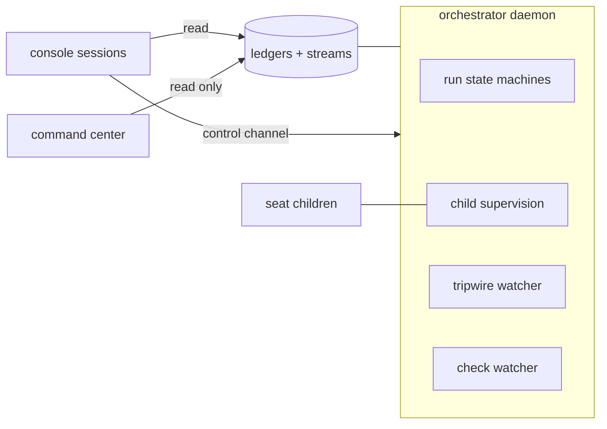

# Architecture

This document is the component map. Detail lands in ADRs as components get
built. [doctrine.md](doctrine.md) states the rules behind the design.

## Shape of the system

One durable **orchestrator daemon** owns every open run as an in-process state
machine. The OS service manager keeps it alive (at-boot, restart-on-failure).
Seats run as headless child processes; a child exit is the transition event.
All run state lives in ledgers; a restart resumes every open run at its
recorded stamp. "Nobody invoked the next phase" is impossible by construction.

Around the daemon:

- **Console sessions** — any Claude session is a cockpit: it reads the ledgers
  and writes control-channel commands the daemon obeys (pause, kill, launch,
  answer). No session owns a run.
- **Command center** — a standalone read-only page plus a small GET server
  rooted at the daemon home. The daemon does not know it exists.
- **Tripwire watcher** — a supervised in-daemon process that re-evaluates
  tripwires when matching events append, and reads stage duration against the
  duration history when a stage heartbeat appends. It classifies and executes
  nothing, and it holds no run.
- **Workflow watcher** — an in-daemon poll of the workflow runs no request
  path covers: the workflows a project names in `watchedWorkflows`, on its
  default branch. It reads the forge's terminal conclusion on the most recent
  completed run, never an elapsed. A red opens one loud item per red run; the
  next green records the recovery that answers it. It holds no run (ADR-0035).
- **Eval seat** — an instance-scoped judgment seat fired every five story-lane
  ships. Its report lands under `eval/` in the daemon home; the queued
  `eval-review` event points to it. Proposals only; nothing self-executes.
- **Notifier** — one optional push target (webhook or command argv) the
  instance config names. It sends parks, run closes and every loud record out
  of the daemon and does nothing else. Unconfigured, it is not there.

## The continuous run

A story runs as one continuous run with these internal states:

readiness → spec birth → spec gate → suite authoring → adversary → freeze →
implementation → verdict (repair rounds as needed) → ship → close-out.

Two lanes share the machinery:

- **Story lane** — the full chain above.
- **Repair lane** — for defects and chores: no spec birth (the intake ticket
  is the spec), no adversary. Fix + regression test + full deterministic gates
  + one generalist review round + one verdict + ship. Writes the run ledger
  and the escapes-ledger entry at close.

A story launch may **resume from a prior run's freeze**: it starts on the
frozen commit, carries the born spec and the freeze record over, stamps
`freeze-inherited` rather than a freeze it never earned, and enters at the
first post-freeze stage. A run that did not ship keeps its branch so the
frozen tree stays reachable. An advanced default branch is merged in and the
red-state gate re-runs; a suite the advance touched, a merge conflict, or a
suite that goes green refuses the launch by name.

## Stores

Three stores plus two indexes, all append-only, all under the daemon home:

- **Per-run ledger** — every run event; archived with the run.
- **Instance ledger** — run-independent events: daemon lifecycle, launches,
  arming changes, config changes, starvation, tripwire breaches, and the
  acknowledgment pairs the standing set of known harness defects is folded
  from.
- **Escapes ledger** — central record of post-merge defects and chores; the
  counted source for quality metrics.
- **Stream indexes** — two central files (queued, loud). The daemon appends a
  pointer (ledger + seq) plus a one-line gist when it stamps a stream-classed
  event, and it appends the pointer before the event itself, so nothing is
  readable in a ledger before it is findable on its stream (ADR-0002). The
  full event lives only in its source ledger.

Every line carries the envelope: `seq` (monotonic per ledger), `ts` (recording
and duration history only; never a trigger), `event` (closed registry),
`actor`, `stream` (stream-classed events only), `refs`, payload inline. The
event registry is closed; a new type enters only by a design-level decision.

A run's length derives from its own ledger in two numbers, and the close-out
record stamps both: wall, from the launch stamp to the close, and active, the
same stretch minus every span the run spent parked on a human or inert under
an unresolved liveness violation. Overlapping spans count once, a span still
open at the end runs to it, and nothing is held between calls, so a restart
and an archive re-derive the same pair. Every duration read that keys on run
length — the command-center ship stat and its target, the eval seat's window
— keys on the active one, with the wall beside it (ADR-0036).

Every loud event and every breach gets a paired `resolved` append in its
source ledger. The open set is derivable: index entries without a linked
resolution. Each loud class names the event that owns it in one table, and the
engine pairs the resolution when that event lands; the run close is the
backstop for the classes no event owns.

## Configuration

Two levels; the ownership test decides placement.

- **Instance config** — daemon home, machine-scoped: model semaphores, paths,
  ledger home, notification-stream wiring, the push `notifier` target, slot
  caps keyed by project, the name patterns this host holds credentials in
  (`secretEnv`), and how long a seat child of this host may emit nothing
  before it is taken to be dead (`seatSilenceMs`). The console edits it live;
  no PR.
- **Project config** — one JSON versioned in the project repo: repo facts,
  commands, gates, conventions, the judgment panel (`review.lenses`), lane
  specifics, per-lane budget thresholds,
  the external credentials the work needs with the read-only probe that
  proves each one and the surfaces each must be wired on, the label rules a
  request's diff is measured against (`labels`), the workflow files the daemon
  watches on the default branch (`watchedWorkflows`), the tripwire registry,
  and the optional close-out extras (`closeout`).
  The daemon reads it from `main` in its bare clone at each run launch, so
  config changes ship through the same PR path as the code they describe.

## Seats

- **Seat map.** Default: Claude Opus 5 at xhigh effort, all seats. Named
  exceptions run on Fable 5 at xhigh: verdict triage, the Fury verifier, and
  the eval seat — the certification spine. `max_tokens` = model max; effort is
  the cost control. Effort stays constant inside a seat session.
- **File contracts.** No structured-output tool anywhere. The seat writes its
  JSON report to the named ledger path; a deterministic process validates it
  (flat, draft-07-safe schemas). One corrective re-prompt, then seat-failure.
  A child that dies on a nonzero exit buys up to 3 re-dispatches per seat
  session before that failure stands, resuming the session it named as it
  died (ADR-0005); nothing else is retried.
- **Prompts.** Two blocks: a shared core (role line, ledger discipline, file
  contract, scope discipline, narration cadence, one-turn execution, concise
  reports) plus a per-seat role block with judgment criteria only. No
  verification scaffolding, no forced progress summaries, no reasoning-echo
  asks. Subagents banned; exception: dev seats may spawn read-only Explore
  subagents, cap 2.
- **Prompt size.** A prompt over the command-line ceiling (32767, the Windows
  limit, applied everywhere) is written to a file in the run directory and the
  spawn carries the path; the substitution stamps `prompt-spilled`. Under the
  ceiling the prompt rides argv unchanged (ADR-0005).
- **Constitution.** A project may version a policy file in its own repository
  (`constitutionPath`, default `.olympus/constitution.md`). Its text rides as
  a third block between the core and the role block, for a closed set of
  seats; the judging seats also carry the authority order — constitution over
  intent card over the run's spec (ADR-0018). No file, no third block.
- **One turn, one session.** Every command runs synchronously inside the
  seat's turn. No background work, no armed watcher, no wait on an outside
  event: the session ends when the seat stops and the machine kills the rest.
  The report is written before the seat stops.
- **Model integrity.** Model-switch flags off on every seat; a classifier flag
  is a seat-failure on the harness route, never a silent downgrade. Outage →
  orchestrator re-dispatch on the default model, recorded with the substitute
  named. A model that refuses the work (read from the seat's own stream, not
  from an exit code) degrades to the default model at the same effort, stamped
  `model-degraded`; the default model refusing too is a loud failure. A run
  that already holds a rejection for a model, with the vendor's reset instant
  still ahead, degrades the next seat at the spawn — the same stamp, marked as
  standing on the run's own record (ADR-0021). The ledger records the actual
  model from the transcript.
- **Seat environment.** At start the daemon reads the three host properties
  every seat depends on and stamps what it finds: the configured runner
  command resolves to an executable file, the runner CLI records trust for the
  paths seats work in, and git in each project clone holds the long-path
  support a deep run worktree needs. One quiet `seat-environment` stamp per
  defect, once per instance; a clean host says nothing, and no finding stops
  the start (ADR-0030).
- **Semaphores.** The daemon holds a global concurrency semaphore per model
  across all runs. A seat waits on the semaphore; it never fails on it.
- **Web tools.** Web search on spec-birth and dev seats only. Judgment seats
  get none.
- **Secrets.** The machine's credentials follow suite execution. A seat marked
  `executesSuite` in the seat map (dev, repair-dev, suite) inherits the host
  environment whole; every other seat is spawned with each variable matching an
  instance-config `secretEnv` pattern removed, and `seat-spawned` carries how
  many went (never which). Project-config commands always run with the full
  environment (ADR-0023).

## Pre-freeze chain (story lane)

readiness (process) → spec birth (seat) → spec gate (seat) → suite authoring
(seat) → adversary → freeze (process).

- **Readiness** is mechanical: card on the graph frontier, open decisions
  empty, references lint-green, worktree provisioned, and every external
  credential the project declares wired on every surface it declared and
  proven by its read-only probe (ADR-0027).
- **Spec birth** authors the buildable spec from the intent card, grounded
  against the repo as it exists that day. AFK; escalates only on open
  decisions or a grounding conflict with the card's intent. The born spec is
  a run artifact — authoritative for its run only, archived at close. The
  spec has a fixed template (ADR-0019): a header, one section per card
  acceptance criterion in card order (intent, test mapping, named constants,
  supersedes), one `touched-paths` block with an owner per path, an
  environment section, 400 lines at most.
- **Spec lint** (process) runs after birth and after every amendment, before
  any judging seat spawns: the criterion sections match the card's id set,
  the cap holds, the touched-paths block parses and its entries clear the
  lane's diff policy, every planned test file lives under a test path, every
  superseded file existed in the worktree or at the run's base sha — the
  candidate's own work deletes what a criterion supersedes, and that deletion
  is the supersede — a dev-owned test-path entry names one file, and
  every test mapping is one bullet on one line with its path first. A
  failure is a work-product defect — one corrective invocation, then the
  `seat-failure` park — and never spends a gate round.
- **Spec gate**: one fresh-context round on the born spec (grounding
  spot-checks, scope against the card, AC encodability), evidence-cited. The
  birth seat amends; the gate re-checks amended sections only. Cap 2 rounds.
  An intent conflict escalates instead of burning a round. Findings carry a
  severity: blocking findings hold the spec; notes do not, and travel to the
  suite seat as obligations to prove against running code. An omitted
  severity is blocking.
- **Gate convergence** (ADR-0020): every round past the first is a re-check.
  Its scope is computed, not declared — the round's spec copy diffed against
  the spec as it stands, part by part — and it carries the previous round's
  findings verbatim. A new defect in an unamended section is a note, except
  an authority contradiction, which blocks anywhere. A round that closes none
  of the blocking findings the round before it raised — by identity, the
  section and the defect it states, so equal counts with moved identities are
  progress — parks the run at once (`spec-gate-stalled`, same options as the
  cap park, remaining cap unspent). The round stamp carries the identities.
- **Adversary**: throwaway wrong implementations, all evaluated to verdict, in
  disposable worktrees. The brief names the security dimensions beside the
  behavior the spec states, so a suite that asserts nothing about
  authorization or input trust shows a survivor and grows a test for it
  (ADR-0038). One wave a round by default;
  `lanes.story.adversaryWaves` raises the count, and the launch pins the config
  blob, so a raise lands at the next launch and never mid-run. A survivor is a
  demonstrated suite gap: one targeted amendment round (a killing test per
  survivor), then freeze. A residual survivor gets a disposition:
  spec-indifferent (recorded) or unkilled gap (blocks; escalates). Zero kills:
  one full strengthening round + a fresh round of waves; a second zero
  escalates.
- **Red-state check** (process): the suite must be red against the
  pre-implementation tree, and the freeze report classes every red as
  feature-absence. Any other cause is a suite defect to fix before freeze.
- **Freeze record**: suite file set at a SHA, kill count, survivor
  dispositions, red-state record, born-spec ref, and the frozen exclusions —
  the test-path files the spec assigned to the implementing pass. The
  exclusions leave the dev seats' deny rules and every story-mode restore;
  the adversary's restore still covers them. The valid record is the
  completion signal.

## Verdict machinery

- **Candidate capture gate.** Before a dev seat's tree becomes an
  implementation commit, the changed paths are judged against the lane's
  optional `diffPolicy` tiers (denied, spec-declared, forbidden patterns).
  A violation stamps a loud `diff-policy-violation` and buys one corrective
  invocation before the `seat-failure` park. A take-back — a write to a path
  the lane froze — stamps the same record and blocks nothing: the capture
  commits the allowed set, the record and the commit both name the dropped
  paths, and every later brief states the freeze and the re-freeze route.
  A take-back from a path the lane declared `recapturablePaths` — a baseline
  or fixture a re-freeze re-takes — stamps the quiet `diff-policy-recapture`
  instead, and the hard tiers outrank the class. The class is decided once,
  here, and honored by every later step that meets the same paths. Nothing is
  ever discarded without a record (ADR-0017).
- **Deterministic core.** Every Tier-1 check (per-layer suites, lint, types,
  build) runs as a process. Unlimited rounds; a rerun judges nothing.
- **Spectrum verdict.** Every runnable Tier-1 layer the cycle runs runs to
  completion; the verdict reports the union of reds. A layer whose
  prerequisite failed reports not-runnable, attributed to the prerequisite.
- **Targeted re-runs.** The first cycle of an implementation pass runs the
  full spectrum. A later cycle runs the targeted set — every layer the pass
  has not proven green, plus everything downstream of one through `needs` —
  and carries the remaining greens forward, marked `carried` in the record so
  no result reads as a fresh proof. A clean targeted cycle runs every layer it
  has not yet run, at that sha, before the verdict turns green; a red that
  confirmation sweep turns up enters triage like any other. A CI verdict whose
  open findings are all env or harness class runs no cycle at all: every one of
  those remedies lands outside the tree, so the operational fix stamps
  `sweep: 'skipped'` with the findings and the reason, the run goes back to
  ship, and the CI re-run is the test (ADR-0022).
- **Progress-keyed cycling.** Every verdict cycle carries a fingerprint over
  what settles its outcome: the implementation pass, the candidate sha, the
  suite sha, the open findings by identity, and, on a CI verdict, the head sha
  with the last conclusion of every check on it. The response ladder reads it
  before it acts. A first
  repeat stamps `cycle-retry` and spends the automatic-retry budget the CI
  re-run spends; a second repeat parks `cycle-repeat` with every occurrence as
  evidence, options `retry` and `abandon`. Productive cycles are unlimited —
  any component that moves is a new fingerprint — and no count is consulted
  anywhere (ADR-0022).
- **Layer starts are visible.** Every gate-layer execution stamps
  `layer-started` (cycle, layer, sha, attempt) before its process runs, so an
  hour inside one layer reads as that layer running since a time rather than as
  a silent ledger. A record, never state: the resume still reads
  `layer-result` alone (ADR-0034).
- **Flake filter.** Each red layer re-runs once, red-only, by process policy.
  A green re-run writes a flake event, never a finding. Survivors are
  persistent reds; only these enter triage.
- **A layer that runs in parts.** A gate command is often a sequence of its
  own, and one exit code covers all of it, so the tail of its stream is
  whatever ran last rather than what failed. A command may say where its parts
  begin — `::olympus part <name>`, and `::olympus part-failed <name>` for one
  that failed — and then the red record keeps a bounded tail per part under
  its name, beside the tail it always kept. Triage reads the failing part; the
  verdict record names it. A command that prints neither line is recorded
  exactly as before.
- **Verdict triage** (judgment, fires only on persistent reds): clusters reds
  into findings by root cause; classes each as code-defect, suite-defect,
  env, or harness, with cited evidence. A harness finding also writes a
  gate-integrity line, unless it names only take-backs the capture classed
  re-capturable: that class was settled at the capture and is not re-judged
  here. Triage classifies, never executes.
- **Response ladder.** Code-defect → repair round on the candidate tree
  (progress-gated: each round must strictly shrink the open finding set; cap
  3). Stall or a verified approach-level finding → one fresh pass per run,
  briefed by born spec + frozen suite + stall brief, never the prior tree; a
  second stall escalates. Suite-defect → re-freeze step by the suite seat at
  a new SHA. Env/harness → operational fix by an orchestrator job; a CI
  verdict open on nothing but these two classes takes no cycle behind its fix.
  A finding that persists past its
  fix parks the provisioning gate, unless every one of them is a harness
  defect an operator acknowledged: then the lane answers the gate on that
  authority and stamps both the acknowledgment it used and the fix
  (ADR-0032). Re-freeze and operational fixes cost no implementation budget.
  An arm that parks does not lose the arms behind it: a render whose open suite
  defects have earned no re-freeze still owes one, and the ladder re-enters to
  deliver it before the next cycle starts.
- **An intent ruling reaches the frozen suite.** An intent-level suite defect
  parks for the owner, who names the frozen test the ruling amends. The ruling
  then rides the re-freeze behind it: the spec seat writes the supersede
  clause, the suite seat is briefed with the ruling and with every frozen file
  it names, and a pass that leaves one of them unchanged is a work-product
  defect. The `re-freeze` stamp records the ruling it carried, which is what
  makes it spent — one ruling, one amendment. Without that route an answer
  could only reach the spec, the unchanged suite would render the same finding
  next cycle, and the run would park on the same question forever.
- **Repair progress is a closed finding, never a smaller open set.** A repair
  round is a stall when it closed none of the findings the render before it
  left open; a round that closes one while the review surfaces another is
  progress, and the run keeps its fresh pass. The key is the identity the cycle
  fingerprint reads — what the finding says, normalized — compared by
  occurrences because that identity normalizes numerals away and two findings
  can reach one. A guard asking whether a round closed anything reads two
  differently worded findings as two, which is why it keeps this key and not
  the coarser one a gate keys an acknowledgment on. The shrink rule the ladder
  entry above describes is retired with it; the cap is unchanged (ADR-0022).
- **Substrate probe before the fix.** An env finding sends the route to the
  host before it spends anything: the run stack's published ports, read off
  the compose project and asked on both loopback families with a write and a
  read inside one bounded deadline. A failed probe parks the provisioning gate
  on its own evidence and no layer re-runs; a clean probe stamps the fix and
  the cycle runs as it always did (ADR-0022).
- **Fury round.** The project's panel (`review.lenses`) over the seats that
  carry its lenses. The default panel is spec, operational, security and
  interface on three seats: security rides the operational seat, interface
  fires only on UI diffs, and architecture + minimality are out of the default
  set, so the code-shape seat that carries them spawns only where a project
  names them back (ADR-0038). One round per pass, on the candidate tree,
  before the verdict renders. No re-fan-out over a judged tree. The verifier
  confirms or refutes each HIGH; only confirmed HIGHs enter the verdict
  (confirm-to-block).
- **Repair-lane review.** Deterministic gates in full; judgment collapses to
  one generalist review seat (the same panel on one seat, diff-scoped,
  per-lens reporting). The verifier fires only when HIGHs exist.

## Ship step

- The run ends at close-out, not at the green verdict. In-loop ship, no
  batching.
- **The update stage** (ADR-0033) sits between the verdict and the ship. The
  run takes the project's ship token there, and its first act under the token
  is the branch update against the default branch as it stands after the
  previous holder's merge. An update that moved the tree hands the run back to
  the verdict, so the tree that opens a request is a tree a verdict certified;
  a base that did not move costs one fetch and a stamp. A conflict surfaces
  here, before any request, and takes the merge round it always took.
  `UPDATE_CAP` bounds the updates per implementation pass; past it the run
  falls through to the ship-stage update.
- **The restore anchor** (ADR-0033) is the sha every story-mode restore of the
  test paths checks out from: the freeze commit until the tree merges the
  default branch, the merge commit after that, and the commit a fresh pass was
  born on after a reset — the freeze again for a pass reset to the
  pre-implementation tree, and for a merge-born pass the commit that carried
  the frozen suite onto the updated default branch. The restore covers the
  whole of the test paths, so the anchor decides the content of every test-path
  file the run never wrote, and that content belongs to the tree the request
  lands on.
- **The ship token** (ADR-0033) is one per project, derived from the run
  ledgers: a run between its acquire or its `pr-opened` and its `merged` or
  its close holds it, and every other open run that stamped a wait is in the
  queue, ordered by the stamp it queued with. No file, no lock — a restart
  re-derives the same holder and the same order. Only the holder opens or
  merges a request; the slot cap stays the concurrency knob for everything
  before that.
- **Ship preflight.** Before the PR opens: every declared credential is read
  on every surface and probes again, because a key the launch proved can go
  stale inside a run and CI is the most expensive way to learn it (ADR-0027);
  then branch protection and the auto-merge capability. Anything missing parks
  a provisioning gate naming every gap at once.
- The harness arms auto-merge (squash) at PR open. Branch protection names
  the full required-check set; the flag fires only on full green. No human
  touch on the green path.
- **The request is created carrying its labels** (ADR-0008). The labels the
  diff derives ride the create call itself: the forge starts a request's
  checks the moment it opens one, so a label applied after that races the
  check that reads it, and a check judging the request as created can never
  see the label at all. The apply call stays behind it as the fallback — a
  forge whose create takes no labels, and a create that found the request
  already open.
- The **check watcher** polls check runs and stamps every state transition to
  the run ledger: per-check, PR merged/closed, merge-commit checks, and
  "green but auto-merge did not fire" (harness-class red). Pending is a
  state, never a verdict.
- **Forge states are not check states** (ADR-0008). A request the forge calls
  conflicting gets no merge ref, so it runs no workflow and its head can
  carry no check at all; it takes the branch-update route a request behind
  its base takes. A head sha with no check run of any name was never
  delivered; after a bounded count of polls that saw nothing, the run spends
  one re-delivery and then parks a provisioning gate. Both stamp
  `forge-anomaly` first — a watcher may not sit on either and say nothing.
- **A red check is not a finished workflow run** (ADR-0008). A check reports
  one job, and a job that fails early leaves the rest of its run executing
  while the log the triage would read is still being written. The watcher
  holds such a red until the run ends — one `triage-wait` stamp per wait, and
  the CI verdict carries how long it waited — and the log fetch asserts the
  same fact before it downloads a byte.
- **The bar is the run's own report of completion** (ADR-0008). A workflow run
  the forge would not answer for holds the dispatch exactly as one that said
  `in_progress` does: the question is not whether the run is still going but
  whether it said it was done, and an unreadable run said nothing. The triage
  dispatch takes that read for itself, right before the first log it asks for,
  so the rule belongs to the thing it protects rather than to whoever calls in.
- **A defect the harness recognizes has a name** (ADR-0008, ADR-0024). Every
  `gate-integrity` record carries a `kind` from the closed `DEFECT_KINDS` set,
  and `escape-recorded` takes the same word where the harness already used it.
  Three kinds today: `auto-merge`, `pr-label-missing` (a request that did not
  carry its labels out of the create, answered by that request's merge) and
  `triage-log-missing` (a CI failure log the forge answered with a reason
  instead of the log, answered by nobody — the reason still reaches the triage
  seat, and the absence is now counted rather than absorbed).
- **One red regime.** CI reds get one automatic re-run of failed jobs, then
  the same four-class triage and the same routes as in-run reds. Budgets are
  shared.
- **The re-run budget is the finding's, not the head sha's** (ADR-0008). One
  automatic re-run per (run, finding), counted across head shas, attempts and
  verdict cycles. A cancelled attempt spends the budget and never refreshes
  it — a cancel is somebody stopping the work — and only an operational fix
  grants the next re-run. An exhausted budget routes the red to the triage
  that was going to judge it anyway, never to another re-run.
- **The harness never merges red.** A human admin-merge over persistent reds
  is a red-merge breach: recorded loud, open findings convert to
  escapes-ledger entries, each gets a self-contained repair ticket in the
  daemon home and is owed a repair-lane run. The breaching run enqueues; the
  frontier sweep launches, because that run still holds its own slot.
- Close-out: watch merge-commit checks to terminal states, run the card
  sweep, run the reconciliation judgment, run the learning artifact if the
  project configured one, close the run ledger.
- **Reconciliation judgment** (ADR-0026): a fresh-context seat judges
  whether the shipped diff implements or contradicts any decision record.
  Owed writes a reconciliation ticket and stamps `reconciliation-judged`;
  not-owed and seat-failure stamp too — an unjudged ship is a recorded
  miss, never a silent skip. The rewrite runs later as its own repair-lane
  run, never inside the run that shipped the diff.
- **Learning artifact** (ADR-0031): optional, by project config
  (`closeout.learning`: an instructions file and a workspace directory, both
  absolute). A fresh-context seat writes a human-readable lesson about the
  shipped story under the owner's instructions, inside the workspace and
  nowhere else. Every failure stamps `learning-lesson` with `ok: false` and
  the reason and the close proceeds: one attempt, no park, no loud item, no
  failed close. An unconfigured project runs the close-out it always ran.

## Parallelism and isolation

- **Worktrees.** The daemon keeps one bare clone per project; at run launch
  it creates a fresh run worktree, seats receive the absolute path, at close
  it removes the worktree. No shared checkout exists.
- **Workspace release.** At close the release ends what is standing in the
  workspace, removes the worktrees, and deletes the tree. It never fails on
  the shape of a path: every delete the harness performs itself goes in the
  extended-length Windows form, and a worktree `git worktree remove` refuses
  is deleted directly and then pruned. A hold is retried on a bounded ladder;
  a workspace that outlives it is a quiet leftover record naming the directory
  and the processes standing in it, which the periodic sweep retries
  (ADR-0004).
- **Run stacks.** Each run launches its own compose project, named by run id,
  from the project's compose template. No fixed host ports; connection
  strings derive from the run's env. No bus is shared between runs.
- **Slots.** The slot cap is an instance-config value per project, counting
  active runs of any lane. Parked runs free their slot. Scale-down to width 1
  is a number, never idle machinery.
- **Merges.** Branch protection requires branches current with main. On a
  competing merge the daemon merges main into the open branch (never
  force-push); full CI re-runs; auto-merge stays armed. A textual conflict
  gets one merge round (fresh dev seat, conflict brief, resolution only;
  test-file hunks route to the suite seat); a failed round is a stall.
- **Merge order.** Ships are serial per project and everything before them is
  not: the ship token (ADR-0033) admits one run at a time from the update
  stage to its merge, and the queue order is derived from the ledgers. Launch
  still follows roadmap order; merge order is the order the runs reached the
  seam.

## Escalations and the human

- **Touchpoint catalog** (closed, ten park events): open decisions at build
  start; grounding conflict at spec birth; intent conflict at spec gate;
  spec-gate exhaustion; spec-gate non-convergence; unkilled-gap survivor;
  second 0/3 adversary round; second stall; card invalidated at ship-time
  sweep; provisioning gate.
- Park = stamped escalation record (question, context refs, answer forms) + a
  queued-stream event. The answer is a state change from any console session;
  the daemon validates, stamps who and when, resumes at the parked state.
- **Every park states what it accepts, on the record**: the options it offers,
  the free-text slot it wants, or both. The engine adds `abandon` to every
  park of a run, so the close-by-abandon route is open at all of them; the
  card-invalidated park has no run behind it and offers none. A refusal quotes
  the forms, and the queue renders the answer line off the same declaration.
- **A known harness defect is answered once.** A provisioning gate that names
  a harness finding also offers `ack`, which answers the gate and records that
  finding as known and deferred, by an identity derived from the defect — its
  class and the gate layer it names — rather than from the run that raised it
  or the sentence a seat wrote about it. A later gate whose findings are all
  acknowledged answers itself and stamps what it stood on, however the seat
  that raised them worded them. An acknowledgment recorded under the older
  words-derived fingerprint still answers the gate it was recorded at.
  Acknowledgments never cover an env or product finding, are folded from
  `finding-ack` / `finding-ack-revoked` pairs in the instance ledger so a
  restart clears none, and end one at a time through `olympusctl revoke`,
  which carries the fix it stands on (ADR-0032).
- **Escalation queue**: always open, answerable from the record alone,
  presented FIFO with roadmap-order tiebreak, answered in any order.
- **One park, one answer, and the record names the session that gave it.** A
  console stamps `console:<user>:<session>`, where the session half is derived
  at invocation (`OLYMPUS_CONSOLE_ID` when the operator set one, else the
  terminal's session variable, else the parent shell) and falls back to the
  bare login when a host offers nothing. The channel carries the stamp through
  unchanged. The first answer to a park wins; a second is refused with the
  reason file its command earned. The identity attributes an answer, it never
  authorises one (ADR-0009).
- **Streams.** Queued: park events, tripwire breaches, stage overruns. Loud: liveness
  violation, gate-integrity defect, diff-policy violation, red-merge breach,
  factory starvation, owed repairs, budget breach. Consoles render loud first,
  then queue depth, and a loud item leaves the strip as soon as the event that
  owns it lands.
- **Reading is pull; what waits on a human also pushes.** A park, a run close
  and every loud record go to the instance's notifier target when one is
  configured — a webhook, or an argv resolved like every other configured
  command. Every console surface stays a read of the ledgers.

## Liveness

Four layers, no timeouts:

1. Child supervision: exit events; seat-failure path.
2. The liveness invariant: every open run holds an in-flight child, a parked
   escalation, or a transition in progress. A violation is a harness-class
   red, loud.
3. Progress telemetry compared against duration history. A seat stamps its own
   progress. Every stage beats besides: a polling handler stamps one heartbeat
   per batch of poll outcomes with the evidence of its wait, and the engine
   runs a stage beat over every handler it dispatches, stamping on a
   five-minute interval and standing down for the interval whenever another
   voice has already spoken for the stage. So a stage in progress says
   something at least every five minutes whatever it holds, and a stage past
   the duration band of that stage of that lane opens a queued record for the
   operator (ADR-0034).
4. A breach alerts, never auto-kills; a generous per-seat cost ceiling
   terminates as a guardrail and records a seat-failure event.
5. The silence deadline: a seat child that emits nothing at all — no frame on
   stdout, none on stderr — for `seatSilenceMs` (two hours by default,
   instance config) is killed, and the close stamps `seat-failure` on reason
   `silence` with the deadline in force. The runner treats it as a crash, so
   the seat re-dispatches into the session the dead child named. Total elapsed
   runtime stays unbounded: only silence has a ceiling (ADR-0037).

## Frontier auto-launch

The daemon fills a free slot from the story-graph frontier in roadmap order,
at any hour. A story that is not ready self-parks at spec-birth escalation.
Phase gates bound the launchable set. The console gives pause, reorder, and a
kill switch. Zero active runs while parked work exists = factory starvation,
loud.

Owed breach repairs take their slots first: a sweep launches the ticketed
escapes that have no repair run before it looks at the story frontier
(ADR-0024). A pause is never bypassed — a paused project with owed repairs
goes loud instead, and the stamp resolves when the repairs launch or the
escapes it names are fixed some other way.

An escape ends by a repair run's close-out (`escape-fixed`, with the run, the
PR and the merge behind it) or by an operator's fixed-mark
(`escape-marked-fixed`, `olympusctl fixed`, with the required evidence it
stands on). The owed set retires on either; the ledger says which happened.
Every repair launch carries the escape it repairs in its run payload, whether
the sweep built it, the console named it with `--escape`, or the daemon read
it off the ticket path — the close-out fix-back reads that field and nothing
else, and a console launch that names no open escape is refused before it
takes a slot.

Owed decision-record reconciliations launch second, after repairs and
before stories (ADR-0026): shipped runs judged owed at close-out, minus
those a reconciliation run's launch stamp already names — derived from the
run ledgers at every sweep, stored nowhere, restart-idempotent.

## Tripwires

The tripwire registry lives in project config; a cut and its tripwire land in
one PR. Entry: id, metric (closed set the daemon implements), window (a state
count: shipped stories, freezes, verdicts), breach condition, trigger events,
answer. The in-daemon watcher is event-keyed: an append that matches a
tripwire's trigger events re-evaluates it. A breach opens once, stays open
until resolved, re-arms at resolution. Wall-clock as trigger stays banned;
durations are legal metric data.

One tripwire stands outside the registry, because it watches the harness and
not a project's quality: stage duration. Its key is the heartbeat a stage in
progress stamps — a poll beat or the engine's stage beat, so every stage keys
it — its band is what the same stage of the same lane did in the other runs of
the project, and its answer is a queued record naming the stage, the elapsed,
what the stage was waiting on and the band. Under five completed visits there
is no band and the watcher says nothing (ADR-0034).

Two standing tripwires watch the harness's own housekeeping rather than a
project's quality: failed workspace releases over the last ten releases, and
the age of the oldest workspace no release has cleared. Both were set from the
ledgers that showed the condition, and both take the machinery's ordinary
escalation — a queued breach, open until a human answers it (ADR-0010).

Standing quality bar (written by the runs themselves, never mined from
outside): escaped defects per story (ceiling 0.5, rolling 10 ships),
gate-integrity defects (zero-tolerance incidents), adversary kill rate at
freeze (0/N blocks), per-lens review yield (zero-yield lane = cut candidate).

## Cost and budgets

One derivation answers what a run spent: per seat invocation, the terminal
stamp supersedes its progress snapshots, and an invocation that ended without
one contributes its last snapshot. Every display and every threshold reads it.

Project config may give a lane a budget in US dollars. The first seat terminal
stamp that puts the run at or past it stamps `budget-breach` once, loud, and
the run carries on: a threshold informs, and never parks, blocks, or closes
anything. The run pairs the resolution at close (ADR-0021).

## Command center

One HTML page plus one small dependency-free read-only server, rooted at the
daemon home, GET-only, path-guarded. The page fetches state on load, polls
every 60 s (display cadence only), and has a manual refresh. Content: status
chips, loud strip, run cards with stage pipeline, escalations, build health,
run-time statistics, ledger tail. Dark command-center look.

## Proof

Two tiers, two CI jobs, both on every push.

`npm test` is the unit and integration suite under `test/`: every part against
the graph its fixture builds, with scripted children in place of seats and
substituted runners in place of compose and the forge.

`npm run test:e2e` is the binary proof under `e2e/`: `bin/olympusd.mjs`
started as a child process and driven by `bin/olympusctl.mjs` through a whole
story run and a whole repair run against a throwaway git project. Real control
files, real ledgers, real worktrees, real gate commands; the seat CLI and the
forge CLI are stubs behind their instance-config seams, and nothing else is
substituted. What it does not reach — docker stacks, a live forge, model
seats, the Windows process branches, the red routes — is named in ADR-0025
with where each is proven instead.
