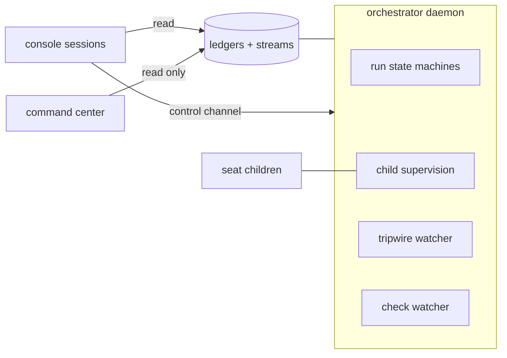

# Architecture

This document is the component map. Detail lands in ADRs as components get
built. [doctrine.md](doctrine.md) states the rules behind the design.

## Shape of the system

One durable **orchestrator daemon** owns every open run as an in-process state
machine. The OS service manager keeps it alive (at-boot, restart-on-failure).
Seats run as headless child processes; a child exit is the transition event.
All run state lives in ledgers; a restart resumes every open run at its
recorded stamp. "Nobody invoked the next phase" is impossible by construction.

Around the daemon:

- **Console sessions** — any Claude session is a cockpit: it reads the ledgers
  and writes control-channel commands the daemon obeys (pause, kill, launch,
  answer). No session owns a run.
- **Command center** — a standalone read-only page plus a small GET server
  rooted at the daemon home. The daemon does not know it exists.
- **Tripwire watcher** — a supervised in-daemon process that re-evaluates
  tripwires when matching events append. It classifies and executes nothing.
- **Eval seat** — an instance-scoped judgment seat fired every five story-lane
  ships. Its report lands under `eval/` in the daemon home; the queued
  `eval-review` event points to it. Proposals only; nothing self-executes.

## The continuous run

A story runs as one continuous run with these internal states:

readiness → spec birth → spec gate → suite authoring → adversary → freeze →
implementation → verdict (repair rounds as needed) → ship → close-out.

Two lanes share the machinery:

- **Story lane** — the full chain above.
- **Repair lane** — for defects and chores: no spec birth (the intake ticket
  is the spec), no adversary. Fix + regression test + full deterministic gates
  + one generalist review round + one verdict + ship. Writes the run ledger
  and the escapes-ledger entry at close.

A story launch may **resume from a prior run's freeze**: it starts on the
frozen commit, carries the born spec and the freeze record over, stamps
`freeze-inherited` rather than a freeze it never earned, and enters at the
first post-freeze stage. A run that did not ship keeps its branch so the
frozen tree stays reachable. An advanced default branch is merged in and the
red-state gate re-runs; a suite the advance touched, a merge conflict, or a
suite that goes green refuses the launch by name.

## Stores

Three stores plus two indexes, all append-only, all under the daemon home:

- **Per-run ledger** — every run event; archived with the run.
- **Instance ledger** — run-independent events: daemon lifecycle, launches,
  arming changes, config changes, starvation, tripwire breaches.
- **Escapes ledger** — central record of post-merge defects and chores; the
  counted source for quality metrics.
- **Stream indexes** — two central files (queued, loud). The daemon appends a
  pointer (ledger + seq) plus a one-line gist when it stamps a stream-classed
  event. The full event lives only in its source ledger.

Every line carries the envelope: `seq` (monotonic per ledger), `ts` (recording
and duration history only; never a trigger), `event` (closed registry),
`actor`, `stream` (stream-classed events only), `refs`, payload inline. The
event registry is closed; a new type enters only by a design-level decision.

Every loud event and every breach gets a paired `resolved` append in its
source ledger. The open set is derivable: index entries without a linked
resolution.

## Configuration

Two levels; the ownership test decides placement.

- **Instance config** — daemon home, machine-scoped: model semaphores, paths,
  ledger home, notification-stream wiring, slot caps keyed by project, and the
  name patterns this host holds credentials in (`secretEnv`). The console edits
  it live; no PR.
- **Project config** — one JSON versioned in the project repo: repo facts,
  commands, gates, conventions, lane specifics, per-lane budget thresholds,
  and the tripwire registry.
  The daemon reads it from `main` in its bare clone at each run launch, so
  config changes ship through the same PR path as the code they describe.

## Seats

- **Seat map.** Default: Claude Opus 5 at xhigh effort, all seats. Named
  exceptions run on Fable 5 at xhigh: verdict triage, the Fury verifier, and
  the eval seat — the certification spine. `max_tokens` = model max; effort is
  the cost control. Effort stays constant inside a seat session.
- **File contracts.** No structured-output tool anywhere. The seat writes its
  JSON report to the named ledger path; a deterministic process validates it
  (flat, draft-07-safe schemas). One corrective re-prompt, then seat-failure.
  A child that dies on a nonzero exit buys up to 3 fresh dispatches per seat
  session before that failure stands (ADR-0005); nothing else is retried.
- **Prompts.** Two blocks: a shared core (role line, ledger discipline, file
  contract, scope discipline, narration cadence, one-turn execution, concise
  reports) plus a per-seat role block with judgment criteria only. No
  verification scaffolding, no forced progress summaries, no reasoning-echo
  asks. Subagents banned; exception: dev seats may spawn read-only Explore
  subagents, cap 2.
- **Constitution.** A project may version a policy file in its own repository
  (`constitutionPath`, default `.olympus/constitution.md`). Its text rides as
  a third block between the core and the role block, for a closed set of
  seats; the judging seats also carry the authority order — constitution over
  intent card over the run's spec (ADR-0018). No file, no third block.
- **One turn, one session.** Every command runs synchronously inside the
  seat's turn. No background work, no armed watcher, no wait on an outside
  event: the session ends when the seat stops and the machine kills the rest.
  The report is written before the seat stops.
- **Model integrity.** Model-switch flags off on every seat; a classifier flag
  is a seat-failure on the harness route, never a silent downgrade. Outage →
  orchestrator re-dispatch on the default model, recorded with the substitute
  named. A model that refuses the work (read from the seat's own stream, not
  from an exit code) degrades to the default model at the same effort, stamped
  `model-degraded`; the default model refusing too is a loud failure. A run
  that already holds a rejection for a model, with the vendor's reset instant
  still ahead, degrades the next seat at the spawn — the same stamp, marked as
  standing on the run's own record (ADR-0021). The ledger records the actual
  model from the transcript.
- **Semaphores.** The daemon holds a global concurrency semaphore per model
  across all runs. A seat waits on the semaphore; it never fails on it.
- **Web tools.** Web search on spec-birth and dev seats only. Judgment seats
  get none.
- **Secrets.** The machine's credentials follow suite execution. A seat marked
  `executesSuite` in the seat map (dev, repair-dev, suite) inherits the host
  environment whole; every other seat is spawned with each variable matching an
  instance-config `secretEnv` pattern removed, and `seat-spawned` carries how
  many went (never which). Project-config commands always run with the full
  environment (ADR-0023).

## Pre-freeze chain (story lane)

readiness (process) → spec birth (seat) → spec gate (seat) → suite authoring
(seat) → adversary → freeze (process).

- **Readiness** is mechanical: card on the graph frontier, open decisions
  empty, references lint-green, worktree provisioned.
- **Spec birth** authors the buildable spec from the intent card, grounded
  against the repo as it exists that day. AFK; escalates only on open
  decisions or a grounding conflict with the card's intent. The born spec is
  a run artifact — authoritative for its run only, archived at close. The
  spec has a fixed template (ADR-0019): a header, one section per card
  acceptance criterion in card order (intent, test mapping, named constants,
  supersedes), one `touched-paths` block with an owner per path, an
  environment section, 400 lines at most.
- **Spec lint** (process) runs after birth and after every amendment, before
  any judging seat spawns: the criterion sections match the card's id set,
  the cap holds, the touched-paths block parses and its entries clear the
  lane's diff policy, every planned test file lives under a test path, every
  superseded file exists, and a dev-owned test-path entry names one file. A
  failure is a work-product defect — one corrective invocation, then the
  `seat-failure` park — and never spends a gate round.
- **Spec gate**: one fresh-context round on the born spec (grounding
  spot-checks, scope against the card, AC encodability), evidence-cited. The
  birth seat amends; the gate re-checks amended sections only. Cap 2 rounds.
  An intent conflict escalates instead of burning a round. Findings carry a
  severity: blocking findings hold the spec; notes do not, and travel to the
  suite seat as obligations to prove against running code. An omitted
  severity is blocking.
- **Gate convergence** (ADR-0020): every round past the first is a re-check.
  Its scope is computed, not declared — the round's spec copy diffed against
  the spec as it stands, part by part — and it carries the previous round's
  findings verbatim. A new defect in an unamended section is a note, except
  an authority contradiction, which blocks anywhere. A round that does not
  strictly shrink the blocking count parks the run at once
  (`spec-gate-stalled`, same options as the cap park, remaining cap unspent).
- **Adversary**: fixed 3 waves of throwaway wrong implementations, all
  evaluated to verdict, in disposable worktrees. A survivor is a demonstrated
  suite gap: one targeted amendment round (a killing test per survivor), then
  freeze. A residual survivor gets a disposition: spec-indifferent (recorded)
  or unkilled gap (blocks; escalates). 0/3 kills: one full strengthening
  round + 3 fresh waves; a second 0/3 escalates.
- **Red-state check** (process): the suite must be red against the
  pre-implementation tree, and the freeze report classes every red as
  feature-absence. Any other cause is a suite defect to fix before freeze.
- **Freeze record**: suite file set at a SHA, kill count, survivor
  dispositions, red-state record, born-spec ref, and the frozen exclusions —
  the test-path files the spec assigned to the implementing pass. The
  exclusions leave the dev seats' deny rules and every story-mode restore;
  the adversary's restore still covers them. The valid record is the
  completion signal.

## Verdict machinery

- **Candidate capture gate.** Before a dev seat's tree becomes an
  implementation commit, the changed paths are judged against the lane's
  optional `diffPolicy` tiers (denied, spec-declared, forbidden patterns).
  A violation stamps a loud `diff-policy-violation` and buys one corrective
  invocation before the `seat-failure` park. A take-back — a write to a path
  the lane froze — stamps the same record and blocks nothing: the capture
  commits the allowed set, the record and the commit both name the dropped
  paths, and every later brief states the freeze and the re-freeze route.
  Nothing is ever discarded without a record (ADR-0017).
- **Deterministic core.** Every Tier-1 check (per-layer suites, lint, types,
  build) runs as a process. Unlimited rounds; a rerun judges nothing.
- **Spectrum verdict.** Every runnable Tier-1 layer the cycle runs runs to
  completion; the verdict reports the union of reds. A layer whose
  prerequisite failed reports not-runnable, attributed to the prerequisite.
- **Targeted re-runs.** The first cycle of an implementation pass runs the
  full spectrum. A later cycle runs the targeted set — every layer the pass
  has not proven green, plus everything downstream of one through `needs` —
  and carries the remaining greens forward, marked `carried` in the record so
  no result reads as a fresh proof. A clean targeted cycle runs every layer it
  has not yet run, at that sha, before the verdict turns green; a red that
  confirmation sweep turns up enters triage like any other (ADR-0022).
- **Flake filter.** Each red layer re-runs once, red-only, by process policy.
  A green re-run writes a flake event, never a finding. Survivors are
  persistent reds; only these enter triage.
- **Verdict triage** (judgment, fires only on persistent reds): clusters reds
  into findings by root cause; classes each as code-defect, suite-defect,
  env, or harness, with cited evidence. A harness finding also writes a
  gate-integrity line. Triage classifies, never executes.
- **Response ladder.** Code-defect → repair round on the candidate tree
  (progress-gated: each round must strictly shrink the open finding set; cap
  3). Stall or a verified approach-level finding → one fresh pass per run,
  briefed by born spec + frozen suite + stall brief, never the prior tree; a
  second stall escalates. Suite-defect → re-freeze step by the suite seat at
  a new SHA. Env/harness → operational fix by an orchestrator job. Re-freeze
  and operational fixes cost no implementation budget.
- **Fury round.** Six lenses on five seats (architecture + minimality merge
  into one code-shape seat with per-lens reporting; interface fires only on
  UI diffs). One round per pass, on the candidate tree, before the verdict
  renders. No re-fan-out over a judged tree. The verifier confirms or refutes
  each HIGH; only confirmed HIGHs enter the verdict (confirm-to-block).
- **Repair-lane review.** Deterministic gates in full; judgment collapses to
  one generalist review seat (all six lenses, diff-scoped, per-lens
  reporting). The verifier fires only when HIGHs exist.

## Ship step

- The run ends at close-out, not at the green verdict. In-loop ship, no
  batching.
- The harness arms auto-merge (squash) at PR open. Branch protection names
  the full required-check set; the flag fires only on full green. No human
  touch on the green path.
- The **check watcher** polls check runs and stamps every state transition to
  the run ledger: per-check, PR merged/closed, merge-commit checks, and
  "green but auto-merge did not fire" (harness-class red). Pending is a
  state, never a verdict.
- **One red regime.** CI reds get one automatic re-run of failed jobs, then
  the same four-class triage and the same routes as in-run reds. Budgets are
  shared.
- **The harness never merges red.** A human admin-merge over persistent reds
  is a red-merge breach: recorded loud, open findings convert to
  escapes-ledger entries, each gets a self-contained repair ticket in the
  daemon home and is owed a repair-lane run. The breaching run enqueues; the
  frontier sweep launches, because that run still holds its own slot.
- Close-out: watch merge-commit checks to terminal states, run the card
  sweep, run the reconciliation judgment, close the run ledger.
- **Reconciliation judgment** (ADR-0026): a fresh-context seat judges
  whether the shipped diff implements or contradicts any decision record.
  Owed writes a reconciliation ticket and stamps `reconciliation-judged`;
  not-owed and seat-failure stamp too — an unjudged ship is a recorded
  miss, never a silent skip. The rewrite runs later as its own repair-lane
  run, never inside the run that shipped the diff.

## Parallelism and isolation

- **Worktrees.** The daemon keeps one bare clone per project; at run launch
  it creates a fresh run worktree, seats receive the absolute path, at close
  it removes the worktree. No shared checkout exists.
- **Run stacks.** Each run launches its own compose project, named by run id,
  from the project's compose template. No fixed host ports; connection
  strings derive from the run's env. No bus is shared between runs.
- **Slots.** The slot cap is an instance-config value per project, counting
  active runs of any lane. Parked runs free their slot. Scale-down to width 1
  is a number, never idle machinery.
- **Merges.** Branch protection requires branches current with main. On a
  competing merge the daemon merges main into the open branch (never
  force-push); full CI re-runs; auto-merge stays armed. A textual conflict
  gets one merge round (fresh dev seat, conflict brief, resolution only;
  test-file hunks route to the suite seat); a failed round is a stall. No
  merge-order machinery: launch follows roadmap order, merge order is free.

## Escalations and the human

- **Touchpoint catalog** (closed, ten park events): open decisions at build
  start; grounding conflict at spec birth; intent conflict at spec gate;
  spec-gate exhaustion; spec-gate non-convergence; unkilled-gap survivor;
  second 0/3 adversary round; second stall; card invalidated at ship-time
  sweep; provisioning gate.
- Park = stamped escalation record (question, context refs, options) + a
  queued-stream event. The answer is a state change from any console session;
  the daemon validates, stamps who and when, resumes at the parked state.
- **Escalation queue**: always open, answerable from the record alone,
  presented FIFO with roadmap-order tiebreak, answered in any order.
- **Streams.** Queued: park events + tripwire breaches. Loud: liveness
  violation, gate-integrity defect, diff-policy violation, red-merge breach,
  factory starvation.
  Consoles render loud first, then queue depth. Pull only.

## Liveness

Four layers, no timeouts:

1. Child supervision: exit events; seat-failure path.
2. The liveness invariant: every open run holds an in-flight child, a parked
   escalation, or a transition in progress. A violation is a harness-class
   red, loud.
3. Progress telemetry stamps compared against per-seat-type duration history.
4. A breach alerts, never auto-kills; a generous per-seat cost ceiling
   terminates as a guardrail and records a seat-failure event.

## Frontier auto-launch

The daemon fills a free slot from the story-graph frontier in roadmap order,
at any hour. A story that is not ready self-parks at spec-birth escalation.
Phase gates bound the launchable set. The console gives pause, reorder, and a
kill switch. Zero active runs while parked work exists = factory starvation,
loud.

Owed breach repairs take their slots first: a sweep launches the ticketed
escapes that have no repair run before it looks at the story frontier
(ADR-0024). A pause is never bypassed — a paused project with owed repairs
goes loud instead, and the stamp resolves when the repairs launch.

Owed decision-record reconciliations launch second, after repairs and
before stories (ADR-0026): shipped runs judged owed at close-out, minus
those a reconciliation run's launch stamp already names — derived from the
run ledgers at every sweep, stored nowhere, restart-idempotent.

## Tripwires

The tripwire registry lives in project config; a cut and its tripwire land in
one PR. Entry: id, metric (closed set the daemon implements), window (a state
count: shipped stories, freezes, verdicts), breach condition, trigger events,
answer. The in-daemon watcher is event-keyed: an append that matches a
tripwire's trigger events re-evaluates it. A breach opens once, stays open
until resolved, re-arms at resolution. Wall-clock as trigger stays banned;
durations are legal metric data.

Standing quality bar (written by the runs themselves, never mined from
outside): escaped defects per story (ceiling 0.5, rolling 10 ships),
gate-integrity defects (zero-tolerance incidents), adversary kill rate at
freeze (0/N blocks), per-lens review yield (zero-yield lane = cut candidate).

## Cost and budgets

One derivation answers what a run spent: per seat invocation, the terminal
stamp supersedes its progress snapshots, and an invocation that ended without
one contributes its last snapshot. Every display and every threshold reads it.

Project config may give a lane a budget in US dollars. The first seat terminal
stamp that puts the run at or past it stamps `budget-breach` once, loud, and
the run carries on: a threshold informs, and never parks, blocks, or closes
anything. The run pairs the resolution at close (ADR-0021).

## Command center

One HTML page plus one small dependency-free read-only server, rooted at the
daemon home, GET-only, path-guarded. The page fetches state on load, polls
every 60 s (display cadence only), and has a manual refresh. Content: status
chips, loud strip, run cards with stage pipeline, escalations, build health,
run-time statistics, ledger tail. Dark command-center look.

## Proof

Two tiers, two CI jobs, both on every push.

`npm test` is the unit and integration suite under `test/`: every part against
the graph its fixture builds, with scripted children in place of seats and
substituted runners in place of compose and the forge.

`npm run test:e2e` is the binary proof under `e2e/`: `bin/olympusd.mjs`
started as a child process and driven by `bin/olympusctl.mjs` through a whole
story run and a whole repair run against a throwaway git project. Real control
files, real ledgers, real worktrees, real gate commands; the seat CLI and the
forge CLI are stubs behind their instance-config seams, and nothing else is
substituted. What it does not reach — docker stacks, a live forge, model
seats, the Windows process branches, the red routes — is named in ADR-0025
with where each is proven instead.
